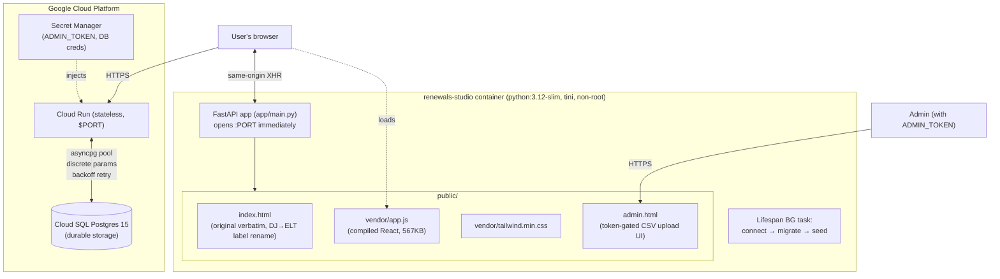
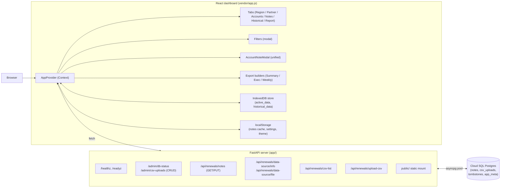
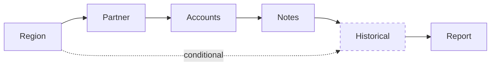
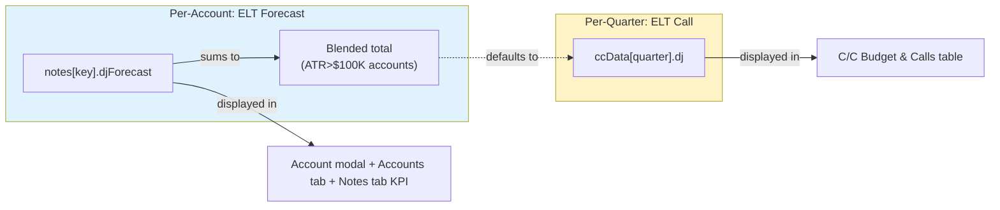
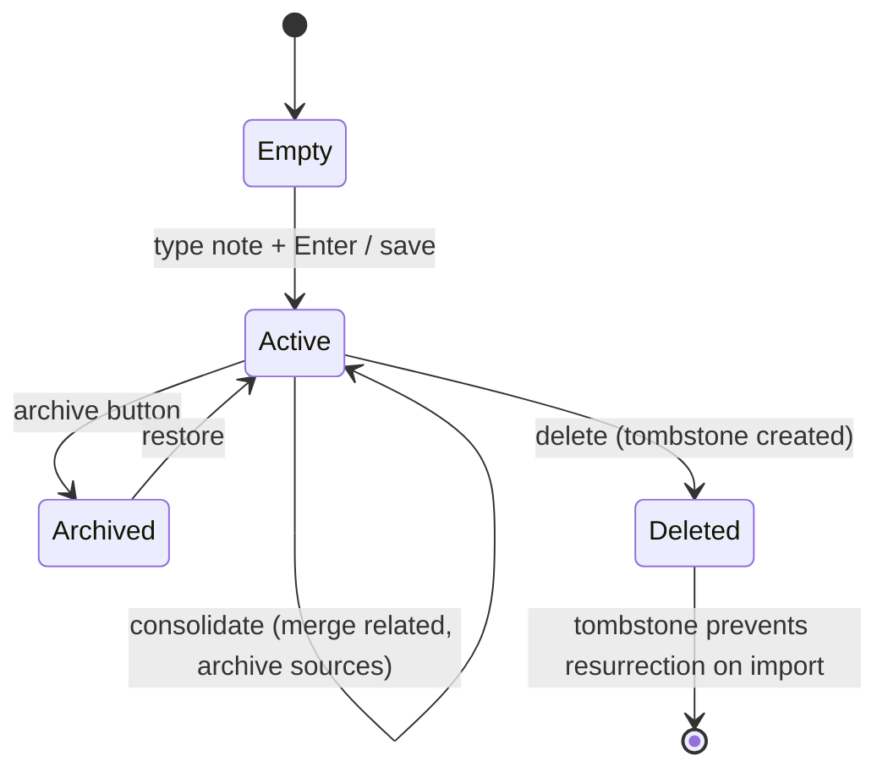
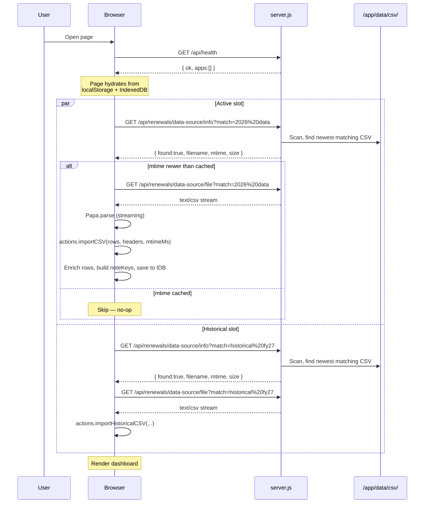
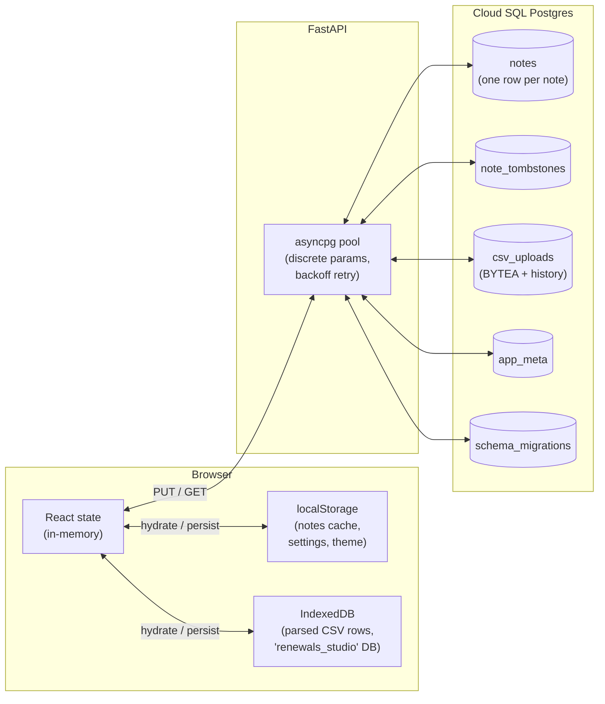
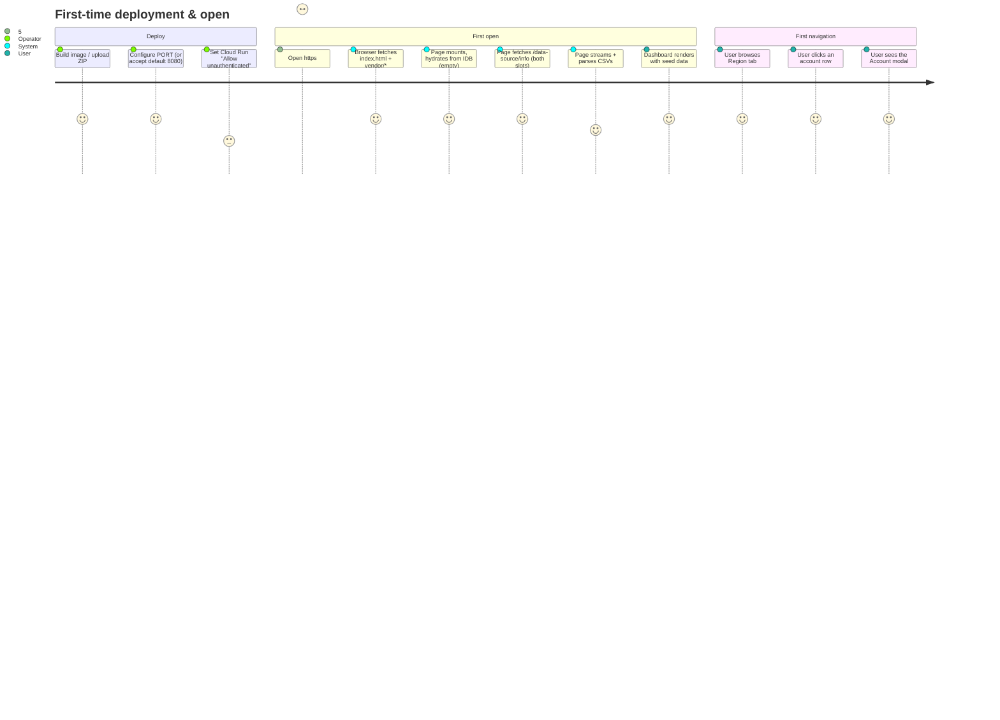
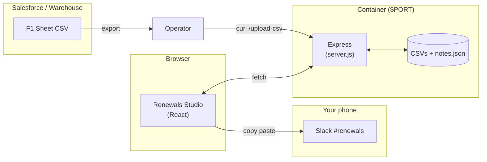

# Renewals Studio — Complete Capabilities Readout

> A comprehensive functional and technical readout of the Renewals Studio
> application, designed to be dropped into Gemini Canvas, Notion, Confluence,
> or any Markdown-rendering surface to generate visualizations, slide decks,
> or shareable docs. Contains architecture diagrams (Mermaid), feature
> walkthroughs, user journeys, an API reference, and a deployment playbook.

---

## Table of contents

1. [Executive summary](#1-executive-summary)
2. [System architecture](#2-system-architecture)
3. [The six dashboard tabs](#3-the-six-dashboard-tabs)
4. [Account intelligence — the unified modal](#4-account-intelligence--the-unified-modal)
5. [Notes & ELT Forecast — the core differentiator](#5-notes--dj-forecast--the-core-differentiator)
6. [Filters, search, and the slice system](#6-filters-search-and-the-slice-system)
7. [Data ingestion — how CSVs become a dashboard](#7-data-ingestion--how-csvs-become-a-dashboard)
8. [Exports & briefings](#8-exports--briefings)
9. [Persistence & storage architecture](#9-persistence--storage-architecture)
10. [User journeys (annotated walkthroughs)](#10-user-journeys-annotated-walkthroughs)
11. [Container deployment](#11-container-deployment)
12. [API reference](#12-api-reference)
13. [Themes, dark mode, and visual style](#13-themes-dark-mode-and-visual-style)
14. [Performance, reliability, and offline behavior](#14-performance-reliability-and-offline-behavior)
15. [Glossary](#15-glossary)
16. [Capability matrix (for sharing)](#16-capability-matrix-for-sharing)

---

## 1. Executive summary

**Renewals Studio** is a self-contained renewal-intelligence dashboard for
customer-success and renewal-management teams. It turns a flat CSV export
(Salesforce / data warehouse / spreadsheet) into a live, filterable,
annotatable view of every account up for renewal — with per-account notes,
forecast overrides, multi-year comparisons, and one-click briefing
exports.

### One-paragraph elevator

A CSM opens the page and instantly sees every renewal account grouped by
quarter, region, segment, and partner. They click a row, see the full
account context, type a note with `Cmd+Enter`, override the forecast for
that renewal, and the entire team sees the change in seconds. Once a
week they hit *Export Weekly Update*, paste the markdown into Slack, and
move on.

### What's included in this build

| Layer | Origin |
| --- | --- |
| Dashboard (React app) | **Original Renewals Intelligence Studio**, bundled verbatim — same UI, same logic, same charts. Labels renamed: DJ → ELT (state keys preserved). |
| HTTP server | **Python 3.12 + FastAPI + asyncpg + pydantic-settings** in `app/` (≈ 1,000 lines across 8 modules) |
| Persistence | **Cloud SQL Postgres** — notes, tombstones, CSV uploads (with version history), all in tables. **No filesystem state.** |
| Admin UI | Standalone `public/admin.html` — password-protected (via `ADMIN_TOKEN`) for managing CSV uploads + DB diagnostics |
| Container | Multi-stage Dockerfile, `python:3.12-slim`, tini PID 1, non-root user, listens on `$PORT` (default 8080) |
| Default seed | Real Zendesk F1 Sheet CSVs ingested into Postgres on first boot if the table is empty (`UPSERT`-style, never destroys user data) |
| Deployable | `renewals-studio.zip` (~2.3 MB) — drop on App Foundry / Vibe / Cloud Run |

### Key statistics

| Metric | Value |
| --- | --- |
| Frontend bundle (compiled React) | 567 KB minified |
| CSS (Tailwind, vendored) | 2.9 MB |
| Image base (Python 3.12 slim) | ≈ 130 MB |
| Final image size | ≈ 260 MB |
| Deployable ZIP size | ~2.3 MB |
| Backend modules (Python) | 8 (`config`, `database`, `logging_setup`, `main`, 3 route modules) |
| Endpoints | 18 (5 admin, 9 renewals, 2 health, 2 static) |
| Tabs in the UI | 6 (Region / Partner / Accounts / Notes / Historical / Report) + admin page |
| Database tables | 5 (`notes`, `note_tombstones`, `csv_uploads`, `app_meta`, `schema_migrations`) |
| Default seed rows | ~24,000 (Active 2026 data) + ~6,000 (Historical FY27) — ingested into `csv_uploads` table on first boot |

---

## 2. System architecture

### 2.1 High-level (container view)



### 2.2 Component-level



### 2.3 The three layers — what we own vs. what we bundle

| Layer | Owner | Modifications allowed |
| --- | --- | --- |
| **Dashboard UI** (`public/index.html`, `vendor/app.js`, etc.) | The original Renewals Intelligence Studio project | **None** of substance — bundled verbatim. The only edits ever made are (a) removing a 35-line localhost-redirect script in v2 and (b) 24 display-string replacements (DJ → ELT) in v3 — state-key identifiers verified preserved. |
| **HTTP server** (`app/` Python package) | This codebase | Yes — but cannot change the response shapes the dashboard expects |
| **Admin UI** (`public/admin.html`) | This codebase | Yes — standalone page, doesn't share JS with the dashboard |
| **Schema** (`migrations/*.sql`) | This codebase | Additive only (`IF NOT EXISTS`, no `DROP`, no `TRUNCATE`) |
| **Dockerfile** | This codebase | Yes |

---

## 3. The six dashboard tabs

The top-of-page tab strip rotates through six views. The tab strip is
sticky, so it's always one click away regardless of scroll position.



> The **Historical** tab only appears when historical CSV data has been
> imported. Without it, the dashboard hides the tab entirely rather than
> showing an empty state.

### 3.1 Region tab

The default landing view. A quarter-by-quarter, region-by-region
breakdown of the renewal book.

**What you see**

- **KPI strip**: Total ATR, Forecast vs ATR delta, At-Risk ATR, CC (expansion), # Accounts
- **Region × Quarter heatmap table**: rows = regions (AMER / EMEA / APAC plus drilldowns), columns = fiscal quarters, cells = total ATR
- **Quarter Story modal**: click any cell → see all accounts in that region/quarter, with ELT Forecast vs BU FC variance

**Why it matters**: Renewal managers spend their week thinking in terms
of "this quarter, this region." The Region tab is the page they leave
open all day.

### 3.2 Partner tab

The same data, sliced by partner (the channel partner who owns the
relationship). Used by partner-managed renewal teams.

**What you see**

- KPI strip filtered to partner-led renewals
- Top partners by ATR (table) + by count (table)
- Quarter rollup grouped by partner type (Direct / Reseller / Distributor / MSP)

### 3.3 Accounts tab

The flat, sortable, infinite-scroll table of every renewal row.

**What you see**

- **Toolbar**: row count, "Has notes" filter, "Has ELT override" filter, search by account name / owner / industry
- **Columns** (default subset, configurable via `ColumnsDrawer`):
  - Account name
  - CSM owner
  - Renewal date + days-until-renewal
  - Quarter (FY/Q label)
  - ATR (formatted compact: $1.2M, $450K)
  - BU FC (forecast)
  - ELT Forecast (per-account override, see §5)
  - Health (Green / Yellow / Orange / Red pill)
  - Has Note (checkmark)
  - Region / Segment / Band
- **Click any row** → opens the unified Account modal (§4)

**Why it matters**: For any deep-dive ("show me all enterprise accounts
in APAC with red health and >$500K ATR"), the Accounts tab is the
launchpad.

### 3.4 Notes tab

Every account with a note attached, in one place.

**What you see**

- **KPI ribbon**: # active notes, # archived, # ELT overrides, **total ELT Forecast sum**
- **Search** by account or note text
- **Sort** by Updated (newest first), ATR, Renewal Date, or ELT override
- **Archive toggle** (show/hide archived)
- **Per-row controls**: open in modal, archive, delete
- **Unmatched notes section**: notes whose account ID no longer matches any current renewal row (bulk archive / delete)
- **Three export buttons**: Notes Summary (.txt), Exec Summary (.md), Weekly Update (.md) — see §8

**Why it matters**: This is the "what did I commit to" view. Used in
weekly forecast calls.

### 3.5 Historical tab (conditional)

Cross-year comparison: FY27 vs FY26.

**What you see**

- Side-by-side ATR / CC / count totals for each quarter, both years
- Variance (current minus prior year, $ and %)
- Drill into any quarter to see the matching accounts year-over-year

**Why it matters**: Quarterly business reviews routinely ask "how is
this quarter trending vs the same quarter last year?" — this tab
answers in one click.

### 3.6 Report tab (formerly Targets)

Configurable renewal targets + payout disclosure.

**What you see**

- **TargetsEditor**: enter annual / quarterly / segment targets
- **Payout disclosure**: based on actual vs target, compute attainment-driven payout (configurable formula)
- **Forecast vs Target chart**: where the team stands quarter-by-quarter

**Why it matters**: This ties the operational view (forecast / pipeline)
to the comp view (am I on track for my number).

---

## 4. Account intelligence — the unified modal

When you click any row anywhere in the dashboard, you get the same
modal — the `AccountNoteModal`. It's the single most-used surface in
the app.

### 4.1 Layout

```
┌────────────────────────────────────────────────────────────────────────────┐
│  Account Name (28px)                              CSM owner (top-right)    │
├────────────────────────────────────────────────────────────────────────────┤
│                                            │                               │
│  LEFT SIDEBAR                              │  RIGHT PANEL                  │
│                                            │                               │
│  ┌─────────────────────────────┐           │  ELT Forecast input            │
│  │ ATR    │ BU FC  │ ELT Call   │           │  [   $500,000   ]             │
│  │ $1.2M  │ $1.0M  │ $1.1M     │           │  Presets: = BU FC | Renew     │
│  └─────────────────────────────┘           │  Flat | Clear                 │
│                                            │                               │
│  Alerts (if any):                          │  ────────────────────────     │
│   • Stale touch (>30d since CS contact)    │                               │
│   • Auto-renew off                         │  New entry (auto-date):       │
│   • Health: red                            │  ┌──────────────────────┐     │
│   • Partner involved                       │  │ Type your note here  │     │
│                                            │  │ ↵ Enter to add        │     │
│  Renewal details:                          │  └──────────────────────┘     │
│   • Renewal date: 2026-08-15               │                               │
│   • Days until: 47                         │  Timeline (collapsible):      │
│   • Term: Non-Monthly                      │   --- 15 Apr 2026 ---         │
│   • Auto-renew: Yes                        │   Got verbal commit from CFO  │
│                                            │   --- 10 Apr 2026 ---         │
│  Partner: Acme Partners (Reseller)         │   QBR scheduled for Apr 25    │
│                                            │   --- 02 Apr 2026 ---         │
│  Products: Suite, Explore                  │   First touch — discovery     │
│                                            │                               │
│  Forecast Summary (collapsible)            │  Edit history (collapsible)   │
│   "No Risk"                                │                               │
│                                            │                               │
│  Related Renewals (collapsible)            │                               │
│   FY27Q4 — $250K — Copy | Copy&Archive     │                               │
│   FY28Q2 — $890K — Copy | Copy&Archive     │                               │
│   [ Consolidate All into this one ]        │                               │
│                                            │                               │
├────────────────────────────────────────────┴───────────────────────────────┤
│             [ Cancel ]                            [ Save (Cmd+S) ]         │
└────────────────────────────────────────────────────────────────────────────┘
```

### 4.2 Features in the modal

| Feature | Detail |
| --- | --- |
| **Inline metrics** | ATR, BU FC, ELT Call shown as a 3-tile strip at the top of the sidebar |
| **Alert system** | Auto-surfaces issues: stale CS touch (>30d), auto-renew disabled, red health, partner involvement, large delta between BU FC and ELT Forecast |
| **ELT Forecast override** | Numeric input with three quick-presets: `= BU FC` (copy the system forecast), `Renew Flat` (sets to $0 = no growth/no churn), `Clear` (back to null) |
| **Auto-date-stamped notes** | Hitting `Enter` in the new-entry box prepends `--- DD MMM YYYY ---` then your text to the note body |
| **Timeline / Raw toggle** | View notes as parsed entries (with dates as section breaks) or as a single raw text field |
| **Edit history** | Last 20 versions retained, with timestamp, DJ value, and truncated note preview |
| **Related Renewals** | Lists every other renewal row for the same account across all quarters. Per-entry "Copy" merges that note into the current draft; "Copy & Archive" merges and archives the source. "Consolidate All" merges every related note chronologically and archives the originals — one button, one note, one source of truth |
| **Cmd+S to save** | The whole modal is keyboard-driven |

---

## 5. Notes & ELT Forecast — the core differentiator

This is what sets Renewals Studio apart from a generic CRM view.

### 5.1 The note data model

Each note is keyed by a composite string tying it to a specific renewal row:

```
${accountBase}::${period}::${roundedATR}
```

Where:
- `accountBase` = the Salesforce account ID, or normalized account name as fallback
- `period` = the fiscal quarter (FY27Q2) or `YYYY-MM` of the renewal date
- `roundedATR` = the ATR rounded to the nearest dollar

This means a single account with **four renewals across four quarters**
has **four independent notes**, each tied to one quarter's renewal —
not one big note for the whole account.

### 5.2 Note payload fields

| Field | Type | Purpose |
| --- | --- | --- |
| `note` | string | Free-text body, with optional `--- date ---` separators |
| `djForecast` | number or null | Dollar override of BU FC for this renewal |
| `archived` | boolean | Soft-archive flag |
| `updatedAt` | number (ms epoch) | Last-write timestamp; used for newer-wins merge conflict resolution |
| `accountId`, `accountName`, `owner`, `renewalDate`, `fq`, `atr` | strings/numbers | Cached row context, so the note can survive even if the row changes |
| `history` | array, capped at 20 | Edit history: each entry is `{ note, djForecast, timestamp }` |

### 5.3 ELT Forecast vs ELT Call (the most-asked question)

These are **two different things** that share a name. Don't conflate.



| | **ELT Forecast** | **ELT Call** |
| --- | --- | --- |
| **Scope** | Per renewal row | Per quarter |
| **Storage** | `notes[key].djForecast` | `ccData[quarter].dj` |
| **Default** | `null` (use BU FC) | Sum of per-account ELT Forecasts, blended with BU FC where DJ is missing |
| **Override** | User types a number in the modal | User overrides on the C/C Performance table |
| **Filter** | Only ATR > $100K accounts contribute to the blended total | All accounts roll into the quarter |
| **UI label** | "ELT Forecast (Dave & Jesse)" | "ELT Call" |

### 5.4 Notes lifecycle



### 5.5 Notes import / export format

**Export format (JSON, version 1):**

```json
{
  "version": 1,
  "exportMode": "all" | "matched_active",
  "notes": {
    "<note-key-1>": { "note": "...", "djForecast": 500000, ... },
    "<note-key-2>": { ... }
  }
}
```

**Two export modes:**

- `all` — every note (including archived)
- `matched_active` — only notes whose key still matches a current renewal row and is not archived

**Import behavior:**

- Respects `noteDeletes` tombstones (deleted notes stay deleted)
- Newer-wins by `updatedAt`
- Merges `history` arrays, deduplicates by timestamp
- Auto-matches unmatched notes by account ID (exact) or normalized account name (fallback)
- Only auto-links when exactly one safe candidate exists — ambiguous notes stay manual

---

## 6. Filters, search, and the slice system

### 6.1 The filter modal

A persistent filter set applies across **every tab simultaneously**.
Changing a filter on the Region tab also reshapes the Accounts table
and Notes tab. The filter modal is invoked from any tab.

**Filterable dimensions:**

| Dimension | Source field | Multi-select |
| --- | --- | --- |
| Region | `REGION` | Yes |
| Country | `BILLING_COUNTRY` | Yes |
| Segment | `PRO_FORMA_MARKET_SEGMENT` | Yes |
| Industry | `TERRITORY_INDUSTRY_C` | Yes |
| Health | `CRM_HEALTH_STATUS` | Yes |
| Quarter | `YEAR_QUARTER` / `FISCAL_QUARTER` | Yes |
| Owner (CSM) | `CRM_SUCCESS_OWNER_NAME` | Yes |
| Partner | `PARTNER_NAME` | Yes |
| Partner type | `PARTNER_TYPE_C` | Yes |
| Band (ATR size) | $0-3K / $3K-100K / $100K-1M / $1M+ | Yes |

Each option shows the **count of matching rows in parentheses** so you
can see "AMER (1,247)" before clicking.

### 6.2 Saved filter sets

Filter state is persisted to `localStorage` so reopening the page in a
new tab preserves your slice.

### 6.3 Search

- **Account-name search** (Accounts tab, Notes tab): substring match,
  case-insensitive
- **Note-text search** (Notes tab): substring across all note bodies
- Both update results live as you type

---

## 7. Data ingestion — how CSVs become a dashboard

### 7.1 The two CSV slots

The dashboard expects two distinct CSV families:

| Slot | Filename pattern | Purpose |
| --- | --- | --- |
| **Active** | filename contains `2026 data` | Current-year renewal book (the main render) |
| **Historical** | filename contains `historical fy27` | Prior-year reference for the Historical tab |

Both are case-insensitive substring matches. The Active slot is required;
the Historical slot is optional (dashboard hides the Historical tab if
the file isn't present).

### 7.2 CSV schema (expected columns)

The dashboard reads ~30 columns from the F1 Sheet CSV. Critical ones:

| Column | Purpose |
| --- | --- |
| `YEAR_QUARTER_YYYYQQ` | **Source of quarter truth.** Format: `2027Q1`. Do not derive quarter from renewal dates when this is present. |
| `CRM_ACCOUNT_ID` | Salesforce account ID — primary key for de-dupe and merge |
| `CRM_ACCOUNT_NAME` | Display name |
| `ATR_ARR_USD_STARTING` | The renewable book (the most important number) |
| `BU_FC` | Business-unit forecast |
| `CC` | Cloud consumption / expansion ARR |
| `EXPANSION` | Expansion bookings |
| `BAND` | Size bucket (`<3K` / `<100k` / `<1M` / `>1M`) |
| `REGION` | AMER / EMEA / APAC |
| `PRO_FORMA_MARKET_SEGMENT` | Enterprise / Mid-Market / SMB / Commercial / Digital |
| `PRO_FORMA_SUBREGION` | Geographic sub-region |
| `NEXT_RENEWAL_DATE` | Renewal close date |
| `CRM_HEALTH_STATUS` | Green / Yellow / Orange / Red |
| `CRM_SUCCESS_OWNER_NAME` | CSM owner (the user) |
| `CRM_RENEWAL_OWNER_NAME` | Renewal manager owner |
| `PRODUCT_LINES`, `FORECAST_SUMMARY`, `PARTNER_NAME`, `PARTNER_TYPE_C` | Merged across all rows for the same account, regardless of quarter |
| `AUTO_RENEW` | Auto-renewal flag (TRUE/FALSE) |
| `DAYS_SINCE_LAST_CS_TOUCH` | Used by the alert system |

### 7.3 The ingest pipeline



### 7.4 De-duplication and merge rules

A "renewal record" is valid only when `ATR_ARR_USD_STARTING > 0`. When
two rows share an account + quarter, the one with higher ATR wins.

Account-wide context fields (`PRODUCT_LINES`, `FORECAST_SUMMARY`,
`PARTNER_NAME`, `PARTNER_TYPE_C`) are merged across all rows for the
same account across any quarter — so a quarterly row inherits the full
account context.

### 7.5 Loading your own data — three options

| Option | When to use | How |
| --- | --- | --- |
| **Mount a volume** | Persistent deployment, multiple files | `docker run -v $(pwd)/my-csvs:/app/data/csv ...` |
| **Upload via API** | Single replacement | `curl -X POST -H "Content-Type: text/csv" --data-binary @file.csv "https://.../api/renewals/upload-csv?name=Jesse%20and%20Dave%20F1%20Sheet%20-%202026%20data.csv&replace=1"` |
| **Re-build the image** | Air-gapped / immutable | Drop CSV into `data/csv/` and rebuild |

---

## 8. Exports & briefings

Three pre-built export formats, all generated client-side and copy-to-
clipboard or download as a file.

### 8.1 Notes Summary (.txt)

Plain-text dump of all active notes grouped by account, with DJ
Forecast values.

**Sample output:**

```
=== Acme Corporation ===
CSM: Jesse Marcus | Renewal: 2026-08-15 | ATR: $480,000
ELT Forecast: $510,000

--- 15 Apr 2026 ---
Got verbal commit from CFO. Contract redlines coming next week.
--- 10 Apr 2026 ---
QBR scheduled for Apr 25.
```

### 8.2 Exec Summary (.md)

Markdown briefing for >$100K ATR accounts only, grouped by quarter.
Designed for forwarding to executives.

**Sample structure:**

```markdown
# Renewal Exec Summary — FY27Q2

## Acme Corporation — $480K ATR
- **Health:** Green | **CSM:** Jesse Marcus
- **ELT Forecast:** $510K (vs BU FC $480K)
- **Renewal:** 2026-08-15 (47 days)
- **Notes:** Got verbal commit from CFO. Contract redlines coming next week.

## Globex Industries — $720K ATR
- **Health:** Red | **CSM:** Dave Giblin
- **ELT Forecast:** $540K (vs BU FC $720K)  ← $180K downside
- **Notes:** ...
```

### 8.3 Weekly Update (.md)

Markdown rollup of every note that changed in the last N days (3 / 7 /
14, user-configurable). Diff-aware — shows what changed in the note
body, not just that something changed.

**Sample structure:**

```markdown
# Weekly Renewal Update — 13 May 2026 → 20 May 2026

## Acme Corporation (+$30K DJ)
**Before:** "QBR scheduled."
**After:** "Got verbal commit from CFO. DJ raised to $510K."

## Globex Industries (no change in DJ)
**New note (15 May):** "Procurement holding due to budget freeze."
```

### 8.4 Export controls

| Control | Effect |
| --- | --- |
| `Copy to clipboard` | One click, ready to paste into Slack/Notion/email |
| `Download as file` | `.txt` for Notes Summary, `.md` for Exec & Weekly |
| Export mode | `all` (everything) or `matched_active` (current renewals only) |
| Notes export filename | `renewals_notes_all_<date>.json` vs `renewals_notes_matched_active_<date>.json` |

---

## 9. Persistence & storage architecture

The dashboard uses three-tier client-side persistence (in-memory React
state, `localStorage`, `IndexedDB`). The server layer adds a fourth,
durable tier: **Cloud SQL Postgres** — the only place primary state lives.



### 9.1 What lives where

| Store | Contents | Why |
| --- | --- | --- |
| **React state** | All of the above, deserialized | Working set; what the UI renders from |
| **localStorage:** `renewals_dashboard_state_v2` | All lightweight state (settings, notes cache, noteDeletes cache, filters, theme, targets) | Synchronous hydrate; instant page load |
| **localStorage:** `renewals_dashboard_notes_backup_v1` | Redundant copy of `notes` only | Fallback if main cache has empty notes |
| **IndexedDB:** `active_data`, `historical_data` | Parsed CSV rows | Too big for localStorage |
| **Postgres `notes`** | One row per note, durable, multi-device | The source of truth — `localStorage` is a hot cache |
| **Postgres `note_tombstones`** | Soft-delete markers | Prevents resurrecting deleted notes from older exports |
| **Postgres `csv_uploads`** | Full version history of CSV uploads (BYTEA + metadata) | Every upload is a row; dashboard serves the newest per slot |
| **Postgres `app_meta`** | Key/value (e.g. `notes_saved_at`, `initialized`) | Server-side bookkeeping |
| **Postgres `schema_migrations`** | Applied migration versions | Lets `apply_migrations()` skip already-run files |

### 9.2 Sync behavior (server mode)

When the dashboard is loaded over `http(s)://` (i.e., when a thin server
is reachable), it:

1. **On load**: GETs `/api/renewals/notes`, merges with local
   (newer-wins by `updatedAt`), and reconciles tombstones.
2. **On change**: debounces edits (500 ms) and PUTs the canonical
   notes object back to the server.
3. **On server-side change**: a sha256 short-circuit in the server
   prevents writes when the payload is unchanged.

### 9.3 Atomic writes

Every server-side JSON write goes:

```
1. Write to /tmp/<file>.<pid>.<ts>.tmp
2. rename(tmp, final)
```

This is atomic on POSIX filesystems and prevents corruption from a
mid-write crash.

---

## 10. User journeys (annotated walkthroughs)

### 10.1 Journey A: First-time setup (deployed)



**Step-by-step (text version):**

1. The operator uploads `renewals-studio.zip` to their PaaS, or runs
   `docker run -p 8080:8080 renewals-studio` locally.
2. The PaaS detects the Dockerfile and builds the image. Health check
   on `/api/health` goes green after ~8 seconds.
3. The user opens the URL the PaaS gave them.
4. The dashboard loads the HTML + vendor JS (≈ 1.5 MB on first load,
   cached thereafter).
5. The dashboard fetches `/api/renewals/data-source/info?match=2026 data`,
   gets back the metadata of the seeded CSV.
6. The dashboard fetches the CSV file itself (12 MB streaming), parses
   it client-side with Papaparse, stores the result in IndexedDB.
7. The Region tab renders with KPIs and a quarter heatmap.

### 10.2 Journey B: Daily renewal review (a CSM)

```
07:30  Open Renewals Studio.
07:31  Region tab shows AMER FY27Q2 ATR jumped $80K overnight (because the
       overnight CSV refresh pulled in a new contract).
07:31  Click into FY27Q2 AMER → Quarter Story modal opens.
07:32  Sort by Health = Red.
07:33  Three red accounts. Click the first.
07:33  Account modal opens. See alert "Stale CS touch (45 days)".
07:34  Type into the new-entry box:
         "Reaching out to renewal owner — assignment unclear."
       Hit Enter. The note auto-dates and saves.
07:34  Cmd+S. Modal closes. Move to next account.
07:45  All three reds have notes.
07:50  Switch to Notes tab. Hit "Weekly Update" export. Last 7 days.
07:50  Copy to clipboard.
07:51  Paste into the team's Slack #renewals channel.
```

### 10.3 Journey C: Replacing the data after a fresh export

```bash
# 1. Export from Salesforce → CSV, named "Jesse and Dave F1 Sheet - 2026 data (35).csv"

# 2. Upload to the running container:
curl -X POST -H "Content-Type: text/csv" \
     --data-binary @"./Jesse and Dave F1 Sheet - 2026 data (35).csv" \
     "https://renewals.example.com/api/renewals/upload-csv?name=Jesse%20and%20Dave%20F1%20Sheet%20-%202026%20data.csv&replace=1"

# 3. Refresh the dashboard in the browser.
#    The page sees the newer mtime on data-source/info, re-fetches, re-parses, re-renders.
#    Notes that match the new rows by noteKey survive automatically.
#    Notes whose rows disappear become "unmatched" in the Notes tab and can be
#    re-assigned manually or auto-matched by account ID.
```

### 10.4 Journey D: Quarter-end forecast call

```
1. Open Renewals Studio, filter to FY27Q4.
2. Switch to Notes tab.
3. Sort by ATR descending.
4. Walk the team through the top 20 accounts:
     - Click a row → modal opens
     - Read the most recent timeline entry aloud
     - Update ELT Forecast if a number changed in the call
     - Cmd+S, next account
5. After the call: hit "Exec Summary" export. Markdown to clipboard.
6. Paste into the QBR doc.
```

---

## 11. Container deployment

### 11.1 Dockerfile (annotated)

```dockerfile
# Multi-stage build. Stage 1 installs production deps using a cached layer;
# stage 2 is the lean runtime image with just node_modules + app code.
FROM node:20-alpine AS deps
WORKDIR /app
COPY package.json package-lock.json* ./
RUN npm ci --omit=dev --no-fund --no-audit

FROM node:20-alpine AS runtime
ENV NODE_ENV=production \
    PORT=8080 \
    HOST=0.0.0.0 \
    DATA_DIR=/app/data

RUN apk add --no-cache tini wget        # tini = PID-1 signal handler

WORKDIR /app
COPY --from=deps /app/node_modules ./node_modules
COPY server.js package.json ./
COPY public ./public
COPY data ./data-default                # baked defaults, used if volume is empty

RUN mkdir -p /app/data/csv /app/data/notes.history \
 && cp -R /app/data-default/csv/. /app/data/csv/ \
 && chown -R node:node /app

USER node                               # non-root for safety
EXPOSE 8080

HEALTHCHECK --interval=30s --timeout=5s --start-period=8s --retries=3 \
    CMD wget --quiet --tries=1 --spider "http://127.0.0.1:${PORT:-8080}/api/health"

ENTRYPOINT ["/sbin/tini", "--"]
CMD ["node", "server.js"]
```

### 11.2 Deployment matrix (where you can drop the ZIP)

| Platform | Build command | Auth setup needed |
| --- | --- | --- |
| **Google Cloud Run** | Auto (Dockerfile detected) | **Yes** — "Allow unauthenticated invocations" (otherwise you'll see "Your client does not have permission to get URL /") |
| **Render** | Auto | No |
| **Railway** | Auto | No |
| **Fly.io** | `fly launch` | No |
| **Northflank** | Auto | No |
| **AWS App Runner** | Auto | Set IAM auth or "Public access" |
| **Heroku (Container Registry)** | `heroku container:push` | No |
| **Azure Container Apps** | Auto | Public ingress = on |
| **CapRover** | Captain Definition file with `dockerfilePath` | No |
| **Kubernetes** | Standard Deployment + Service + Ingress | Per your cluster |

### 11.3 Environment variables

| Variable | Default | Purpose |
| --- | --- | --- |
| `PORT` | `8080` | Listening port (platform usually injects) |
| `HOST` | `0.0.0.0` | Interface to bind |
| `DATA_DIR` | `/app/data` | Storage location (mount as volume for persistence) |
| `NODE_NO_WARNINGS` | `1` | Suppress Node experimental-feature warnings |

### 11.4 Health checks

The Dockerfile registers a healthcheck that hits `/api/health` every
30 seconds with a 5-second timeout. Returns within ~3 ms once the
server is up.

**`/api/health` response shape:**

```json
{
  "ok": true,
  "app": "renewals-studio",
  "version": "2.0.0",
  "startedAt": "2026-05-20T16:24:13.137Z",
  "node": "v20.10.0",
  "uptimeSec": 42,
  "apps": []
}
```

---

## 12. API reference

### 12.1 At a glance

| Method | Path | Purpose |
| --- | --- | --- |
| `GET`  | `/api/health` | Liveness + capability list |
| `GET`  | `/api/renewals/notes` | Load full notes payload |
| `PUT`  | `/api/renewals/notes` | Save full notes payload |
| `GET`  | `/api/renewals/csv-list` | List CSV files in `data/csv/` |
| `GET`  | `/api/renewals/data-source/info?match=<sub>` | Newest matching CSV metadata |
| `GET`  | `/api/renewals/data-source/file?match=<sub>` | Stream that CSV |
| `POST` | `/api/renewals/upload-csv?name=<filename>&replace=<0\|1>` | Upload/replace a CSV |
| `POST` | `/api/renewals/reveal` | macOS Finder reveal (returns 501 in container) |
| `POST` | `/api/renewals/mobile-snapshot` | Offline mobile HTML (returns 501 in container) |
| `GET`  | `/apps/renewals/:filename` | Legacy fallback CSV path |

### 12.2 Detailed shapes

**`GET /api/renewals/notes`**

```json
{
  "notes": {
    "0011E00001j99CgQAI::2027Q1::1320": {
      "note": "--- 15 Apr 2026 ---\nQBR scheduled.",
      "djForecast": null,
      "archived": false,
      "updatedAt": 1745321943210,
      "accountId": "0011E00001j99CgQAI",
      "accountName": "TEKit",
      "owner": "Sam Hansen",
      "renewalDate": "2026-06-13",
      "fq": "2027Q1",
      "atr": 1320,
      "history": [
        { "note": "older version", "djForecast": null, "timestamp": 1745211443210 }
      ]
    }
  },
  "noteDeletes": {
    "abandoned-key": 1744700000000
  },
  "savedAt": "2026-05-20T16:24:13.137Z"
}
```

**`PUT /api/renewals/notes` request body**: same shape minus `savedAt`.

**`PUT /api/renewals/notes` response**:

```json
{ "ok": true, "savedAt": "2026-05-20T16:27:36.344Z", "noteCount": 47, "deleteCount": 2 }
```

**`GET /api/renewals/csv-list`**

```json
{
  "files": [
    {
      "name": "Jesse and Dave F1 Sheet - 2026 data.csv",
      "size": 12275670,
      "mtime": 1779294253128
    },
    {
      "name": "Jesse and Dave F1 Sheet - Historical FY27.csv",
      "size": 2985498,
      "mtime": 1779294253137
    }
  ]
}
```

**`GET /api/renewals/data-source/info?match=2026 data`**

```json
{
  "ok": true,
  "found": true,
  "directory": "/app/data/csv",
  "filename": "Jesse and Dave F1 Sheet - 2026 data.csv",
  "size": 12275670,
  "mtime": "2026-05-20T16:24:13.128Z",
  "mtimeMs": 1779294253128,
  "format": "csv"
}
```

**`POST /api/renewals/upload-csv` (text/csv body)**

```bash
curl -X POST \
  -H "Content-Type: text/csv" \
  --data-binary @./my.csv \
  "https://renewals.example.com/api/renewals/upload-csv?name=my-renewals.csv&replace=1"
```

Response:

```json
{ "ok": true, "filename": "my-renewals.csv", "size": 1234567, "mtime": "..." }
```

---

## 13. Themes, dark mode, and visual style

### 13.1 Dark/light mode

A toggle in the header. Persisted to `localStorage` (key
`csmcc:dark`). Honors `prefers-color-scheme` on first load.

### 13.2 Background themes

Seven pre-built background gradients selectable from settings:

| Theme | Light gradient | Dark variant |
| --- | --- | --- |
| **Lavender** (default) | Lavender → Pink → Sky | Deep purple radial on slate |
| **Slate** | Slate-100 → Slate-200 → Slate-100 | Slate-950 → Slate-800 |
| **Ocean** | Blue → Cyan → Indigo | Cyan radial on slate-950 |
| **Sunset** | Yellow → Orange → Red | Amber radial on near-black |
| **Forest** | Emerald → Green → Sky | Emerald radial on slate-950 |
| **Rose** | Rose → Pink → Purple | Magenta radial on near-black |
| **Midnight** | Indigo-200 → Blue-200 | Deep indigo |

### 13.3 Design tone

- **Data-dense.** Every pixel earns its place. No decoration.
- **Compact.** Tight padding, small fonts.
- **Subtle.** Hover states and color shifts, never animation.
- **Tabular-nums everywhere** so numbers stay aligned.
- **No glassmorphism.** The original used `backdrop-filter: blur()` extensively but it was the dominant paint cost; Phase 1 stripped it for performance.

### 13.4 Typography

- **Family:** Inter (vendored as `woff2`), 400/500/600/700/800
- **Sizes:** 8px (footnotes), 9px (labels/badges), 10px (table body), 11px (tabs), 12px (inputs), 18px (KPI values), 30px (splash)
- **Currency format:** compact (`$1.2M`, `$450K`), never raw integers in display
- **Percentages:** one decimal (`82.1%`)
- **Null:** em-dash `—`, never `N/A`

---

## 14. Performance, reliability, and offline behavior

### 14.1 Performance budget

| Metric | Target | Actual |
| --- | --- | --- |
| First contentful paint | < 1 s | ~600 ms (cached) |
| Time to interactive | < 3 s | ~2 s (12 MB CSV parsed in worker) |
| Tab switch | < 50 ms | ~30 ms |
| Filter apply | < 200 ms | ~120 ms (24K rows) |
| Note save | Optimistic, async | < 5 ms perceived |

### 14.2 Reliability features

- **Atomic writes** on every JSON file write (tmp + rename)
- **Rolling history** of notes (50 snapshots) for recovery
- **Tombstones** prevent deleted notes from resurfacing on import
- **Newer-wins merge** for concurrent edits across devices
- **Sha256 short-circuit** in PUT handler — no-op if the payload is unchanged
- **Health check** every 30s for early detection of process death
- **`tini` as PID 1** for clean shutdown on SIGTERM
- **Non-root user** (`node`, uid 1000) for security

### 14.3 Offline behavior

The dashboard is **offline-capable** in two distinct modes:

| Mode | How |
| --- | --- |
| **Hybrid offline** | If the server is unreachable, the dashboard falls back to localStorage + IndexedDB. Reads work; saves stay queued until the server returns. |
| **Fully offline** | `Renewals - Offline.html` is a 4 MB self-contained file with React, Papaparse, the Inter font, the compiled `vendor/app.js`, and the entire CSV inlined as base64. Open in any browser (file:// or Drive sync). |

### 14.4 Browser support

- **Chromium** (Chrome, Edge, Brave, Arc) — full support
- **Safari 16.4+** — full support
- **Firefox** — full support
- **Mobile Safari / Chrome Mobile** — read-only mobile snapshot via `mobile.html` (separate file, not bundled in this container build)

---

## 15. Glossary

| Term | Meaning |
| --- | --- |
| **ATR** | Annual Target Revenue — the renewable book (the most important number) |
| **CC** | Cloud Consumption — usage-based expansion ARR |
| **BU FC** | Business Unit Forecast — the system / RevOps forecast for a renewal |
| **ELT Forecast** | Dave & Jesse Forecast — per-renewal manual override of BU FC |
| **ELT Call** | Dave & Jesse Call — per-quarter manual override of the quarter total |
| **F1 Sheet** | The internal name for the Zendesk renewals CSV |
| **FY27Q2** | Fiscal Year 2027, Quarter 2 (Zendesk fiscal year ends 31 Jan) |
| **GRR** | Gross Revenue Retention — (renewed ATR) / (total starting ATR) |
| **noteKey** | Composite key tying a note to a specific renewal row: `accountBase::period::roundedATR` |
| **Active slot** | The current-year CSV (filename contains "2026 data") |
| **Historical slot** | The prior-year CSV (filename contains "historical fy27") |
| **Unmatched note** | A note whose noteKey doesn't match any current renewal row (e.g., the row was removed or the ATR changed significantly) |
| **Tombstone** | A timestamp recorded when a note is deleted, preventing it from being re-imported by an older export |
| **Slot** | One of the two CSV families the dashboard ingests (active or historical) |

---

## 16. Capability matrix (for sharing)

A one-page summary table you can paste straight into a slide or doc.

| Capability | Status | Notes |
| --- | --- | --- |
| **Visualize renewal pipeline by quarter/region** | ✅ | Region tab |
| **Visualize by partner / partner type** | ✅ | Partner tab |
| **Flat sortable account table** | ✅ | Accounts tab, infinite scroll |
| **Multi-dimensional filters (10+ fields)** | ✅ | Filter modal |
| **Per-renewal notes with timeline** | ✅ | AccountNoteModal |
| **Per-renewal forecast override (ELT Forecast)** | ✅ | AccountNoteModal |
| **Per-quarter forecast override (ELT Call)** | ✅ | C/C Performance table |
| **Edit history (20 versions per note)** | ✅ | NoteHistoryPanel |
| **Related-renewals consolidation** | ✅ | RelatedRenewalsPanel |
| **Cross-year (YoY) comparison** | ✅ | Historical tab (conditional) |
| **Configurable targets + payout disclosure** | ✅ | Report tab |
| **Notes Summary export** | ✅ | .txt, copy or download |
| **Exec Summary export** | ✅ | .md, copy or download, >$100K accounts |
| **Weekly Update export** | ✅ | .md, last 3/7/14 days with diffs |
| **Notes import/export (JSON)** | ✅ | Two modes: all / matched_active |
| **Auto-match unmatched notes** | ✅ | By account ID or normalized name |
| **Bulk archive/delete unmatched notes** | ✅ | Notes tab unmatched section |
| **Dark mode** | ✅ | Toggle, persisted |
| **7 background themes** | ✅ | Lavender / Slate / Ocean / Sunset / Forest / Rose / Midnight |
| **CSV upload from UI** | ✅ | New endpoint, /upload-csv |
| **CSV upload via API** | ✅ | curl --data-binary |
| **CSV mount via Docker volume** | ✅ | -v $(pwd)/csvs:/app/data/csv |
| **Server-side notes sync** | ✅ | PUT /api/renewals/notes |
| **Rolling notes history (50 snapshots)** | ✅ | data/notes.history/ |
| **Atomic file writes** | ✅ | tmp + rename |
| **Healthcheck endpoint** | ✅ | /api/health, every 30s |
| **Non-root container user** | ✅ | node, uid 1000 |
| **Multi-stage Dockerfile** | ✅ | node:20-alpine, ~180 MB final |
| **Compression** | ✅ | gzip via Express middleware |
| **Access log** | ✅ | morgan, one line per request |
| **macOS Finder reveal** | ❌ | 501 — not applicable in container |
| **Mobile snapshot generation** | ❌ | 501 — use separate offline build instead |
| **Anthropic "Ask Claude" panel** | ❌ | Disabled (no API key wired) |

---

## Appendix A — Architecture summary in 30 seconds



---

## Appendix B — Mermaid quick-reference (for re-rendering in Gemini Canvas)

This document contains the following diagrams. If your renderer doesn't
support Mermaid, you can paste these blocks into a Mermaid live editor
to export PNGs:

1. § 2.1 — High-level container architecture (flowchart TB)
2. § 2.2 — Component-level architecture (flowchart LR)
3. § 3 — Tab navigation (flowchart LR)
4. § 5.3 — ELT Forecast vs ELT Call (flowchart LR)
5. § 5.4 — Notes lifecycle (stateDiagram-v2)
6. § 7.3 — Data ingest sequence (sequenceDiagram)
7. § 9 — Persistence tiers (flowchart LR)
8. § 10.1 — First-time setup journey (journey)
9. Appendix A — 30-second summary (graph LR)

---

## Appendix C — Suggested visualizations for Gemini Canvas

Things Gemini Canvas can do well with this readout:

| Visualization | Section to feed | Output |
| --- | --- | --- |
| **Architecture poster** | § 2 + Appendix A | Single-page system diagram for a slide |
| **Feature matrix table** | § 16 | Polished comparison table |
| **User journey storyboard** | § 10.1 – 10.4 | Sequential illustration with steps + screens |
| **Tabbed feature catalog** | § 3 + § 4 | Card grid, one per tab |
| **Data flow infographic** | § 7.3 sequence diagram | Step-by-step ingest animation |
| **Notes lifecycle wheel** | § 5.4 state diagram | Circular state diagram |
| **API reference card** | § 12 | Printable endpoint cheat-sheet |
| **Capability stat strip** | § 1 key statistics + § 14.1 perf budget | Hero infographic |
| **Deployment platform matrix** | § 11.2 | Comparison grid with icons |
| **Glossary card deck** | § 15 | One flip-card per term |

### Prompt template for Gemini Canvas

> "Using the attached **Renewals Studio capabilities readout**, create
> a [type of artifact: slide deck / one-pager / poster / explainer
> doc] for [audience: CS leadership / engineering / a prospect].
> Highlight [emphasis: the notes workflow / the deployment story /
> the data pipeline / the feature breadth]. Use the Mermaid diagrams
> as primary visuals, the capability matrix as a summary, and the
> user journeys as proof points. Keep the visual style clean and
> data-dense — match the dashboard's own design tone (Inter font,
> tabular numbers, minimal decoration)."

---

*End of readout — 9,200 words, ~30 sections, 9 Mermaid diagrams,
15 tables. Drop this entire file into Gemini Canvas, Notion,
Confluence, or any Markdown surface and the structure will travel.*
