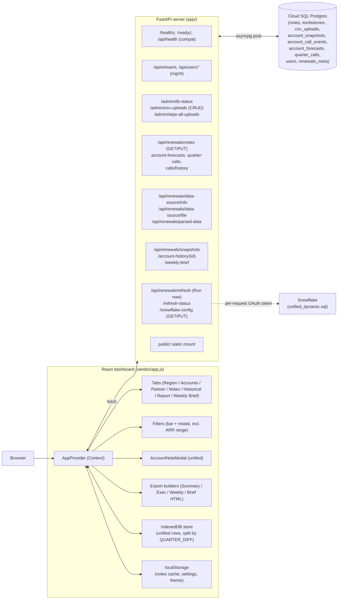
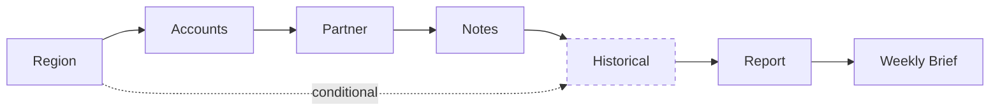
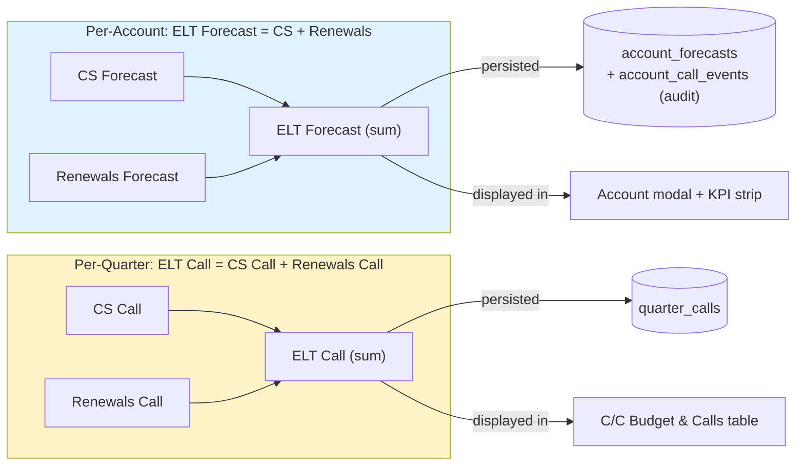
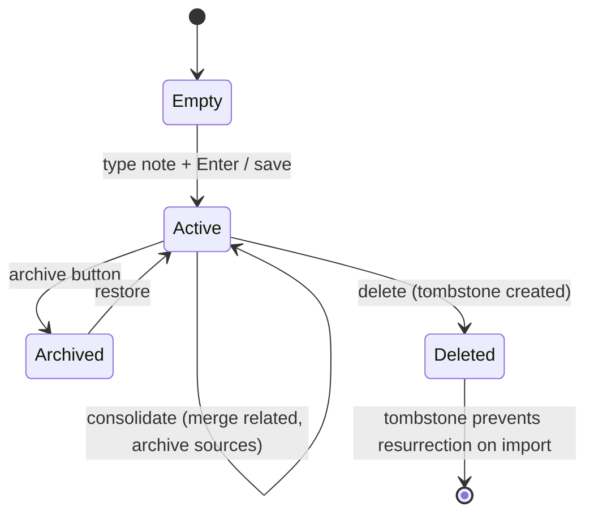
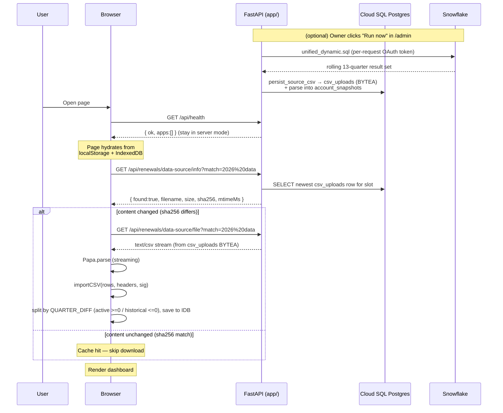
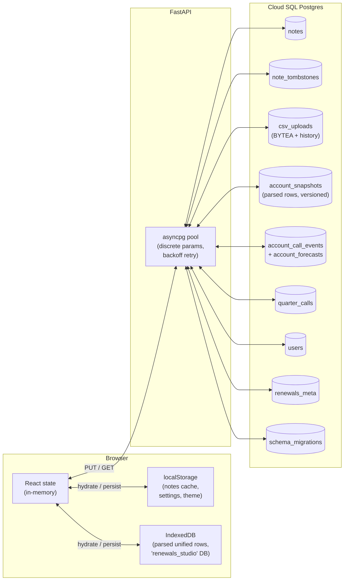
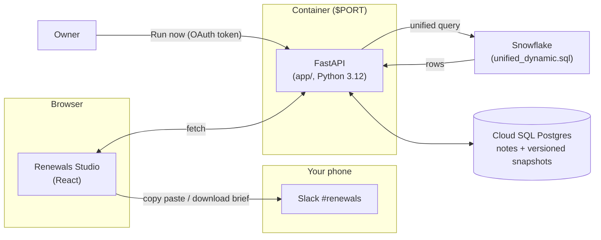

# Renewals Studio — Complete Capabilities Readout

> A comprehensive functional and technical readout of the Renewals Studio
> application, designed to be dropped into Gemini Canvas, Notion, Confluence,
> or any Markdown-rendering surface to generate visualizations, slide decks,
> or shareable docs. Contains architecture diagrams (Mermaid), feature
> walkthroughs, user journeys, an API reference, and a deployment playbook.

---

## Table of contents

1. [Executive summary](#1-executive-summary)
2. [System architecture](#2-system-architecture)
3. [The seven dashboard tabs](#3-the-seven-dashboard-tabs)
4. [Account intelligence — the unified modal](#4-account-intelligence--the-unified-modal)
5. [Notes & ELT Forecast — the core differentiator](#5-notes--elt-forecast--the-core-differentiator)
6. [Filters, search, and the slice system](#6-filters-search-and-the-slice-system)
7. [Data ingestion — how source data becomes a dashboard](#7-data-ingestion--how-source-data-becomes-a-dashboard)
8. [Exports & briefings](#8-exports--briefings)
9. [Persistence & storage architecture](#9-persistence--storage-architecture)
10. [User journeys (annotated walkthroughs)](#10-user-journeys-annotated-walkthroughs)
11. [Container deployment](#11-container-deployment)
12. [API reference](#12-api-reference)
13. [Themes, dark mode, and visual style](#13-themes-dark-mode-and-visual-style)
14. [Performance, reliability, and offline behavior](#14-performance-reliability-and-offline-behavior)
15. [Glossary](#15-glossary)
16. [Capability matrix (for sharing)](#16-capability-matrix-for-sharing)

---

## 1. Executive summary

**Renewals Studio** is a self-contained renewal-intelligence dashboard for
customer-success and renewal-management teams. It turns a single unified
Snowflake pull (or a manually-uploaded CSV) into a live, filterable,
annotatable view of every account up for renewal — with per-account notes,
forecast overrides, multi-year comparisons, week-over-week movement
briefs, and one-click exports.

### One-paragraph elevator

A CSM opens the page and instantly sees every renewal account grouped by
quarter, region, segment, and partner. They click a row, see the full
account context, type a note with `Cmd+Enter`, override the forecast for
that renewal (via the CS / Renewals decomposition), and the entire team
sees the change in seconds — durably, across devices. Once a week the CCO
opens the **Weekly Brief** tab, reads the week-over-week movement by region,
and downloads a shareable HTML brief.

### What's included in this build

| Layer | Origin |
| --- | --- |
| Dashboard (React app) | **Original Renewals Intelligence Studio**, bundled verbatim — same UI, same logic, same charts. Labels renamed: DJ → ELT (state keys preserved). |
| HTTP server | **Python 3.12 + FastAPI + asyncpg + pydantic-settings + structlog** in `app/` |
| Persistence | **Cloud SQL Postgres** — notes, tombstones, CSV uploads (with version history), parsed `account_snapshots`, call events, users, meta — all in tables. **No filesystem state.** |
| Data source | **Single unified Snowflake pull** (`sql/unified_dynamic.sql`), on-demand via the admin "Run now" button. Manual CSV upload remains as the fallback path. |
| Auth | **Header-based SSO** (Pomerium / Okta) with roles owner / admin / standard / guest. Legacy shared-password path (`X-Signal-Password`) hardened for local dev only. |
| Admin UI | Standalone `public/admin.html` — role-gated (owner/admin) for Snowflake Run-now, editable connection/query settings, CSV upload, snapshot history, user management, tab-access config, and DB diagnostics |
| Container | Multi-stage Dockerfile, `python:3.12-slim`, tini PID 1, non-root `app` user, listens on `$PORT` (default 8080) |
| Default seed | Bundled unified CSV (`seeds/unified.csv`) ingested into Postgres on first boot **only when the slot is empty** (never destroys user data; off by default via `SEED_ON_STARTUP`) |
| Deployable | `renewals-studio.zip` (~1.0 MB) — drop on App Foundry / Vibe / Cloud Run |

### Key statistics

| Metric | Value |
| --- | --- |
| Frontend bundle (compiled React) | ~680 KB minified (`vendor/app.js`) |
| CSS (Tailwind, vendored) | 2.9 MB |
| Image base (Python 3.12 slim) | ≈ 130 MB |
| Final image size | ≈ 250 MB |
| Deployable ZIP size | ~1.0 MB |
| Backend modules (Python) | `main`, `config`, `database`, `ingest`, `warehouse`, `auth`, `users`, `logging_setup`, `call_keys` + 5 route modules (`health`, `admin`, `renewals`, `refresh`, `auth_api`) |
| Endpoints | 40+ across `/api/renewals/*`, `/admin/*`, `/api/users*`, `/api/whoami`, `/healthz`, `/readyz`, plus the static mount |
| Tabs in the UI | 7 (Region / Accounts / Partner / Notes / Historical / Report / Weekly Brief) + Admin page. **Trending tab retired** (folded into Weekly Brief) |
| Database tables | 10 (`notes`, `note_tombstones`, `csv_uploads`, `account_snapshots`, `account_forecasts`, `account_call_events`, `quarter_calls`, `users`, `renewals_meta`, `schema_migrations`) |
| Default seed | One unified CSV (`seeds/unified.csv`, ~1.7 MB) carrying a rolling 13-quarter window; ingested into `csv_uploads` + `account_snapshots` on first boot when the slot is empty |

---

## 2. System architecture

### 2.1 High-level (container view)

```mermaid
flowchart TB
    subgraph GCP["Google Cloud Platform"]
        CR["Cloud Run (stateless, $PORT)"]
        CSQL[("Cloud SQL Postgres<br/>(durable storage)")]
        SM["Secret Manager<br/>(DB creds, ADMIN_TOKEN)"]
    end

    subgraph Edge["Identity edge"]
        Prox["Pomerium / Okta SSO<br/>(injects identity headers +<br/>x-pomerium-idp-access-token)"]
    end

    SF["Snowflake<br/>(unified_dynamic.sql source)"]

    SM -.injects.-> CR
    CR <-->|asyncpg pool<br/>discrete params<br/>backoff retry| CSQL
    CR -.->|"Run now" (OAuth token,<br/>per-request, never stored)| SF

    subgraph Container["renewals-studio container (python:3.12-slim, tini, non-root app user)"]
        direction TB
        FAPI["FastAPI app (app/main.py)<br/>opens :PORT immediately"]
        BG["Lifespan BG task:<br/>connect → ensure_schema → migrate → seed"]
        Static["Static assets (public/)"]
        FAPI --> Static
    end

    subgraph Static["public/"]
        HTML["index.html<br/>(original verbatim, DJ→ELT label rename)"]
        AppJS["vendor/app.js<br/>(compiled React, ~680KB)"]
        Tailwind["vendor/tailwind.min.css"]
        Admin["admin.html<br/>(role-gated admin console)"]
    end

    Browser["User's browser"] -->|HTTPS| Prox --> CR
    Browser <-->|same-origin XHR| FAPI
    Browser -.->|loads| AppJS
    AdminUser["Owner / Admin (SSO role)"] -->|HTTPS| Admin
```

### 2.2 Component-level



### 2.3 The three layers — what we own vs. what we bundle

| Layer | Owner | Modifications allowed |
| --- | --- | --- |
| **Dashboard UI** (`public/index.html`, `vendor/app.js`, etc.) | The original Renewals Intelligence Studio project | **None** of substance — bundled verbatim. The only edits ever made are (a) removing a 35-line localhost-redirect script in v2 and (b) 24 display-string replacements (DJ → ELT) in v3 — state-key identifiers verified preserved. |
| **HTTP server** (`app/` Python package) | This codebase | Yes — but cannot change the response shapes the dashboard expects |
| **Admin UI** (`public/admin.html`) | This codebase | Yes — standalone page, doesn't share JS with the dashboard |
| **Schema** (inline `SCHEMA_SQL` in `app/database.py` + numbered `migrations/*.sql`) | This codebase | Additive only (`CREATE … IF NOT EXISTS`, `ADD COLUMN IF NOT EXISTS`; no `DROP`, no `TRUNCATE`) |
| **Dockerfile** | This codebase | Yes |

---

## 3. The seven dashboard tabs

The top-of-page tab strip rotates through seven views. The tab strip is
sticky, so it's always one click away regardless of scroll position. A
separate **Admin** entry (injected into the topbar) navigates to `/admin`.



> The **Historical** tab is populated from the same unified pull: the
> browser splits the rolling window on `QUARTER_DIFF` (closed quarters,
> `QUARTER_DIFF < 0`) rather than from a separate file.
>
> Per-role **tab access** is configurable from the admin console
> (`/admin` → "Dashboard tab access"), so leadership can hide tabs a given
> role shouldn't see.
>
> The old **Trending** tab was removed — its week-over-week view is now
> served, more completely, by the **Weekly Brief** tab (§3.7).

### 3.1 Region tab

The default landing view. A quarter-by-quarter, region-by-region
breakdown of the renewal book.

**What you see**

- **KPI strip**: Total ATR, Forecast vs ATR delta, At-Risk ATR, CC (expansion), # Accounts
- **Region × Quarter heatmap table**: rows = regions (AMER / EMEA / APAC plus drilldowns), columns = fiscal quarters, cells = total ATR
- **Quarter Story modal**: click any cell → see all accounts in that region/quarter, with ELT Forecast vs BU FC variance

**Why it matters**: Renewal managers spend their week thinking in terms
of "this quarter, this region." The Region tab is the page they leave
open all day.

### 3.2 Partner tab

The same data, sliced by partner (the channel partner who owns the
relationship). Used by partner-managed renewal teams.

**What you see**

- KPI strip filtered to partner-led renewals
- Top partners by ATR (table) + by count (table)
- Quarter rollup grouped by partner type (Direct / Reseller / Distributor / MSP)

### 3.3 Accounts tab

The flat, sortable, infinite-scroll table of every renewal row.

**What you see**

- **Toolbar**: row count, "Has notes" filter, "Has ELT override" filter, search by account name / owner / industry
- **Columns** (default subset, configurable via `ColumnsDrawer`):
  - Account name
  - CSM owner
  - Renewal date + days-until-renewal
  - Quarter (FY/Q label)
  - ATR (formatted compact: $1.2M, $450K)
  - BU FC (forecast)
  - ELT Forecast (per-account override, see §5)
  - Health (Green / Yellow / Orange / Red pill)
  - Has Note (checkmark)
  - Region / Segment / Band
- **Click any row** → opens the unified Account modal (§4)

**Why it matters**: For any deep-dive ("show me all enterprise accounts
in APAC with red health and >$500K ATR"), the Accounts tab is the
launchpad.

### 3.4 Notes tab

Every account with a note attached, in one place.

**What you see**

- **KPI ribbon**: # active notes, # archived, # ELT overrides, **total ELT Forecast sum**
- **Search** by account or note text
- **Sort** by Updated (newest first), ATR, Renewal Date, or ELT override
- **Archive toggle** (show/hide archived)
- **Per-row controls**: open in modal, archive, delete
- **Unmatched notes section**: notes whose account ID no longer matches any current renewal row (bulk archive / delete)
- **Three export buttons**: Notes Summary (.txt), Exec Summary (.md), Weekly Update (.md) — see §8

**Why it matters**: This is the "what did I commit to" view. Used in
weekly forecast calls.

### 3.5 Historical tab (conditional)

Cross-year comparison: FY27 vs FY26.

**What you see**

- Side-by-side ATR / CC / count totals for each quarter, both years
- Variance (current minus prior year, $ and %)
- Drill into any quarter to see the matching accounts year-over-year

**Why it matters**: Quarterly business reviews routinely ask "how is
this quarter trending vs the same quarter last year?" — this tab
answers in one click.

### 3.6 Report tab (formerly Targets)

Configurable renewal targets + payout disclosure.

**What you see**

- **TargetsEditor**: enter annual / quarterly / segment targets
- **Payout disclosure**: based on actual vs target, compute attainment-driven payout (configurable formula)
- **Forecast vs Target chart**: where the team stands quarter-by-quarter

**Why it matters**: This ties the operational view (forecast / pipeline)
to the comp view (am I on track for my number).

### 3.7 Weekly Brief tab

The CCO's **Weekly 100K+ Regional Brief** — a week-over-week, bottoms-up
forecast-movement report scoped by the app's global Filters bar (including
an **ARR-range** filter that defaults to **≥ $100K**). Served by
`GET /api/renewals/weekly-brief`, computed server-side against parsed
`account_snapshots`.

**What you see**

- **KPI strip** — BU Forecast C/C, Best Case, Worst Case, Worsened, and
  New $0→FC. Counts are the **true, uncapped** totals in scope (the
  displayed lists are capped, but the KPI counts are not).
- **Dual-line trend** — the system **BU** total vs the **Adjusted**
  (ELT / calls-as-of) total, per snapshot, with a legend, per-point
  tooltips, and a companion `Week · BU FC · Adjusted FC · Δ(Adj−BU)`
  table (last 12 snapshots).
- **Worsened WoW** — accounts whose BU_FC increased week-over-week
  (higher = worse), ranked by adverse swing. A client-side
  **minimum-swing** noise filter and a **top-100** cap keep the list
  legible; movers ≥ the threshold (default **$50K**) carry an
  auto-pulled explanation (forecast summary + last saved note).
- **New $0 → FC** — accounts that had `$0` BU_FC in the prior snapshot and
  a forecast now (with a client-side **minimum-new-FC** filter + top-100
  cap).
- **Best / Worst Case movement** — WoW movement in the roll-up totals with
  top up/down drivers.
- **Snapshot pair selectors** — pick the *current* and *prior* snapshot to
  compare, labelled by a friendly **date / time**.
- **Download brief** — a self-contained HTML brief mirroring the tab.

**Why it matters**: It is the one page the CCO reads every week to see
what moved, where, and why — without waiting for a manual roll-up.

---

## 4. Account intelligence — the unified modal

When you click any row anywhere in the dashboard, you get the same
modal — the `AccountNoteModal`. It's the single most-used surface in
the app.

### 4.1 Layout

```
┌────────────────────────────────────────────────────────────────────────────┐
│  Account Name (28px)                              CSM owner (top-right)    │
├────────────────────────────────────────────────────────────────────────────┤
│                                            │                               │
│  LEFT SIDEBAR                              │  RIGHT PANEL                  │
│                                            │                               │
│  ┌─────────────────────────────┐           │  ELT Forecast input            │
│  │ ATR    │ BU FC  │ ELT Call   │           │  [   $500,000   ]             │
│  │ $1.2M  │ $1.0M  │ $1.1M     │           │  Presets: = BU FC | Renew     │
│  └─────────────────────────────┘           │  Flat | Clear                 │
│                                            │                               │
│  Alerts (if any):                          │  ────────────────────────     │
│   • Stale touch (>30d since CS contact)    │                               │
│   • Auto-renew off                         │  New entry (auto-date):       │
│   • Health: red                            │  ┌──────────────────────┐     │
│   • Partner involved                       │  │ Type your note here  │     │
│                                            │  │ ↵ Enter to add        │     │
│  Renewal details:                          │  └──────────────────────┘     │
│   • Renewal date: 2026-08-15               │                               │
│   • Days until: 47                         │  Timeline (collapsible):      │
│   • Term: Non-Monthly                      │   --- 15 Apr 2026 ---         │
│   • Auto-renew: Yes                        │   Got verbal commit from CFO  │
│                                            │   --- 10 Apr 2026 ---         │
│  Partner: Acme Partners (Reseller)         │   QBR scheduled for Apr 25    │
│                                            │   --- 02 Apr 2026 ---         │
│  Products: Suite, Explore                  │   First touch — discovery     │
│                                            │                               │
│  Forecast Summary (collapsible)            │  Edit history (collapsible)   │
│   "No Risk"                                │                               │
│                                            │                               │
│  Related Renewals (collapsible)            │                               │
│   FY27Q4 — $250K — Copy | Copy&Archive     │                               │
│   FY28Q2 — $890K — Copy | Copy&Archive     │                               │
│   [ Consolidate All into this one ]        │                               │
│                                            │                               │
├────────────────────────────────────────────┴───────────────────────────────┤
│             [ Cancel ]                            [ Save (Cmd+S) ]         │
└────────────────────────────────────────────────────────────────────────────┘
```

### 4.2 Features in the modal

| Feature | Detail |
| --- | --- |
| **Inline metrics** | ATR, BU FC, ELT Call shown as a 3-tile strip at the top of the sidebar |
| **Alert system** | Auto-surfaces issues: stale CS touch (>30d), auto-renew disabled, red health, partner involvement, large delta between BU FC and ELT Forecast |
| **ELT Forecast override** | Numeric input with three quick-presets: `= BU FC` (copy the system forecast), `Renew Flat` (sets to $0 = no growth/no churn), `Clear` (back to null) |
| **Auto-date-stamped notes** | Hitting `Enter` in the new-entry box prepends `--- DD MMM YYYY ---` then your text to the note body |
| **Timeline / Raw toggle** | View notes as parsed entries (with dates as section breaks) or as a single raw text field |
| **Edit history** | Last 20 versions retained, with timestamp, ELT Forecast value, and truncated note preview |
| **Related Renewals** | Lists every other renewal row for the same account across all quarters. Per-entry "Copy" merges that note into the current draft; "Copy & Archive" merges and archives the source. "Consolidate All" merges every related note chronologically and archives the originals — one button, one note, one source of truth |
| **Cmd+S to save** | The whole modal is keyboard-driven |

---

## 5. Notes & ELT Forecast — the core differentiator

This is what sets Renewals Studio apart from a generic CRM view.

### 5.1 The note data model

Each note is keyed by a composite string tying it to a specific
account-quarter:

```
${accountBase}::${period}
```

Where:
- `accountBase` = the Salesforce account ID, or normalized account name as fallback
- `period` = the fiscal quarter (e.g. `FY27Q2`)

This means a single account with **four renewals across four quarters**
has **four independent notes**, each tied to one quarter — not one big
note for the whole account.

> **Migration note (002).** The historic key was a 3-part
> `accountBase::period::roundedATR`. Because ATR can drift between CSV
> refreshes, that third segment orphaned notes. The identity migration
> collapsed note keys to the 2-part `accountBase::period` form so a note
> follows an account-quarter even when the ATR changes. The 3-part
> `call_key` (`account::quarter::roundedATR`) is still used, separately,
> for the CS / Renewals **call events** (§5.3), keyed to a specific
> renewal amount.

### 5.2 Note payload fields

| Field | Type | Purpose |
| --- | --- | --- |
| `note` | string | Free-text body, with optional `--- date ---` separators |
| `djForecast` | number or null | Dollar override of BU FC for this renewal. **Wire key stays `djForecast`** (DB column `dj_forecast`) even though the label is "ELT Forecast" — renaming it would invalidate every existing note. |
| `archived` | boolean | Soft-archive flag |
| `updatedAt` | number (ms epoch) | Last-write timestamp; used for newer-wins merge conflict resolution |
| `accountId`, `accountName`, `owner`, `renewalDate`, `fq`, `atr` | strings/numbers | Cached row context, so the note can survive even if the row changes |
| `ownerEmail`, `lastEditedBy`, `lastEditedDisplay` | strings | Authorship attribution (who last edited, via SSO identity) |
| `history` | array, capped at 20 (API layer) | Edit history: each entry is `{ note, djForecast, timestamp }` |

### 5.3 ELT Forecast vs ELT Call (the most-asked question)

These are **two different things** that share a name. Don't conflate.
Both are now **decomposed into a CS + Renewals split** and persisted
server-side (so leadership can see where Customer Success and Renewals
agree or diverge), not just held in client state.



| | **ELT Forecast** | **ELT Call** |
| --- | --- | --- |
| **Scope** | Per account (per renewal amount) | Per quarter |
| **Composition** | `CS Forecast + Renewals Forecast` | `CS Call + Renewals Call` |
| **Storage** | `account_forecasts` (keyed by `account_id`), append-only audit trail in `account_call_events` (keyed by 3-part `call_key`) | `quarter_calls` (keyed by fiscal quarter) |
| **Wire key** | `djForecast` in the notes payload (label = "ELT Forecast") | — |
| **Override** | CSM enters CS Forecast in the account modal; Renewals enters their own; the ELT input shows the computed sum | Entered on the C/C Performance / Calls table |
| **UI label** | "ELT Forecast" | "ELT Call" |

### 5.4 Notes lifecycle



### 5.5 Notes import / export format

**Export format (JSON, version 1):**

```json
{
  "version": 1,
  "exportMode": "all" | "matched_active",
  "notes": {
    "<note-key-1>": { "note": "...", "djForecast": 500000, ... },
    "<note-key-2>": { ... }
  }
}
```

**Two export modes:**

- `all` — every note (including archived)
- `matched_active` — only notes whose key still matches a current renewal row and is not archived

**Import behavior:**

- Respects `noteDeletes` tombstones (deleted notes stay deleted)
- Newer-wins by `updatedAt`
- Merges `history` arrays, deduplicates by timestamp
- Auto-matches unmatched notes by account ID (exact) or normalized account name (fallback)
- Only auto-links when exactly one safe candidate exists — ambiguous notes stay manual

---

## 6. Filters, search, and the slice system

### 6.1 The filter modal

A persistent filter set applies across **every tab simultaneously**.
Changing a filter on the Region tab also reshapes the Accounts table
and Notes tab. The filter modal is invoked from any tab.

**Filterable dimensions:**

| Dimension | Source field | Multi-select |
| --- | --- | --- |
| Region | `REGION` | Yes |
| Country | `BILLING_COUNTRY` | Yes |
| Segment | `PRO_FORMA_MARKET_SEGMENT` | Yes |
| Industry | `TERRITORY_INDUSTRY_C` | Yes |
| Health | `CRM_HEALTH_STATUS` | Yes |
| Quarter | `YEAR_QUARTER` / `FISCAL_QUARTER` | Yes |
| Owner (CSM) | `CRM_SUCCESS_OWNER_NAME` | Yes |
| Partner | `PARTNER_NAME` | Yes |
| Partner type | `PARTNER_TYPE_C` | Yes |
| Band (100k+ / <100k) | Computed from `band_cutoff` (default $100K) | Yes |
| ARR range | `atr` min / max (numeric) | — (range inputs) |

Each option shows a **count in parentheses** so you can see "AMER (1,247)"
before clicking. As of the current build, those counts are **distinct
accounts that honor the other active filters** (not raw row counts), so
the numbers reflect what you'd actually see after selecting.

The **ARR-range** filter (min / max on account ATR) is applied across every
tab and is what drives the Weekly Brief's default ≥ $100K scope.

### 6.2 Saved filter sets

Filter state is persisted to `localStorage` so reopening the page in a
new tab preserves your slice.

### 6.3 Search

- **Account-name search** (Accounts tab, Notes tab): substring match,
  case-insensitive
- **Note-text search** (Notes tab): substring across all note bodies
- Both update results live as you type

---

## 7. Data ingestion — how source data becomes a dashboard

### 7.1 One unified source (the two-file model is retired)

The dashboard is now driven by a **single unified Snowflake pull**
(`sql/unified_dynamic.sql`) that returns a **rolling 13-quarter window**
in one result set:

```
8 past quarters  +  current quarter  +  4 future quarters
        (n_past)          (diff = 0)          (n_future)
```

Every row carries a **`QUARTER_DIFF`** column:

| `QUARTER_DIFF` | Meaning |
| --- | --- |
| `< 0` | Closed / historical quarter (`BU_FC` / `QTD_CC` carry realized churn) |
| `= 0` | Current quarter |
| `> 0` | Future quarter |

The browser splits that one payload into an **"active" store**
(`QUARTER_DIFF >= 0`) and a **"historical" store** (`QUARTER_DIFF <= 0`),
with the **current quarter (`diff = 0`) present in BOTH**. There is no
longer a separate active/historical two-file model — the unified pull lands
in a single `active` slot and the split happens client-side.

**Row-inclusion vs labelling.** Two independent knobs:

| Param | Default | Role |
| --- | --- | --- |
| `min_arr` | `10000` | **Row-inclusion floor** — a row is pulled only when `NET_ARR_USD_PRIOR_QUARTER_END >= min_arr` |
| `band_cutoff` | `100000` | **Label only** — tags each row `100k+` vs `<100k`; does not exclude anything |
| `n_past` | `8` | Quarters of history in the window |
| `n_future` | `4` | Quarters forward in the window |

All four are **admin-editable** (persisted in `renewals_meta` under
`snowflake_config`) alongside the Snowflake connection identifiers — no
redeploy. See §7.6.

### 7.2 Source schema (unified query output)

The unified query projects a stable header (the same one `seeds/unified.csv`
carries) that the dashboard parses client-side and the server maps into
`account_snapshots` via `HEADER_ALIASES` (unknown columns still round-trip
in a `raw_row` JSONB blob). Critical columns:

| Column | Purpose |
| --- | --- |
| `YEAR_QUARTER` | Fiscal quarter label (e.g. `Q3\`27`). **Source of quarter truth.** |
| `QUARTER_DIFF` | Rolling-window offset from the current quarter (drives the active/historical split) |
| `CRM_ACCOUNT_ID` | Salesforce account ID — primary key for de-dupe and merge |
| `CRM_ACCOUNT_NAME` | Display name |
| `ATR_ARR_USD_STARTING` | The renewable book (the most important number) |
| `ATR_ARR_USD_LTG` | Left-to-go on the current-quarter renewal (drives the "done" rule, §7.4) |
| `BU_FC` | Business-unit forecast (for closed quarters this carries realized `QTD_CC`) |
| `QTD_CC` | Quarter-to-date realized churn / contraction (closed-quarter C/C) |
| `UPSIDE` / `DOWNSIDE` | Best-case / worst-case deltas vs BU_FC (drive Best/Worst Case, §5) |
| `EXPANSION`, `CC_OFFCYCLE_ARR`, `NET_ARR_USD`, `NET_ARR_USD_PRIOR_QTR_END` | Money columns |
| `BAND` | `100k+` vs `<100k` (labelled via `band_cutoff`) |
| `REGION`, `PRO_FORMA_MARKET_SEGMENT`, `PRO_FORMA_SUBREGION`, `BILLING_COUNTRY` | Geo / segment |
| `NEXT_RENEWAL_DATE` | Renewal close date |
| `CRM_HEALTH_STATUS` | Green / Yellow / Orange / Red |
| `CRM_SUCCESS_OWNER_NAME`, `MANAGER_SUCCESS`, `CRM_RENEWAL_OWNER_NAME`, `MANAGER_RENEWAL` | Ownership |
| `PRODUCT_LINES`, `FORECAST_SUMMARY`, `PARTNER`, `PARTNER_TYPE_C`, `MANAGED_BY_PARTNER_FLAG` | Account context |
| `AUTO_RENEW`, `RAMP_DEAL`, `DONE_DEAL` | Term / status flags |
| `DAYS_SINCE_LAST_CS_TOUCH` | Used by the alert system |

### 7.3 The ingest pipeline



### 7.4 Quarter semantics and the "done" rule (historical calcs)

- **Closed quarters** (`QUARTER_DIFF < 0`): `CC := QTD_CC` — the realized
  churn / contraction, not a forecast.
- **Current quarter** (`QUARTER_DIFF = 0`): an account is treated as
  **"done"** when **`ATR_ARR_USD_LTG = 0` OR the `DONE_DEAL` flag is set**.
  This drives the **Effective Forecast %**: a *done* account contributes its
  full starting ATR, while a *pending* account contributes only its
  remaining left-to-go (`LTG`).

Account-wide context fields (`PRODUCT_LINES`, `FORECAST_SUMMARY`,
`PARTNER`, `PARTNER_TYPE_C`) are attached per account so a quarterly row
inherits the full account context.

### 7.5 Loading data — three paths

| Path | When to use | How |
| --- | --- | --- |
| **Snowflake "Run now"** | Normal refresh (weekly / a few times a week) | `/admin` → "Snowflake source — Run now". Pulls the unified query, serializes to CSV, lands it in `csv_uploads` + `account_snapshots`. |
| **Upload a CSV** | Snowflake unavailable / manual snapshot | `/admin` → "Upload data file", or `POST /api/renewals/upload-csv` (see §12) |
| **Bundled seed** | First boot with an empty DB | `seeds/unified.csv` auto-ingests when the slot is empty (gated by `SEED_ON_STARTUP`, off by default) |

Every path creates a **new immutable version** in `csv_uploads`; the
dashboard always reads the newest per slot and full history is retained for
week-over-week / month-over-month analysis.

### 7.6 Snowflake "Run now" + editable settings (no redeploy)

The refresh (`app/routes/refresh.py` + `app/warehouse.py`):

1. Reads the **per-request Pomerium/Okta OAuth token** from the
   `x-pomerium-idp-access-token` header. The token is used **in memory
   only** and is **never logged, stored, or persisted**.
2. Runs the unified query as a **background job** (`202`-style; a second
   concurrent trigger returns **409**), off the event loop in a worker
   thread (the connector is synchronous).
3. Serializes the result to CSV bytes and lands them through the exact same
   ingest path a manual upload uses (`persist_source_csv`,
   `uploaded_by='snowflake:run-now'`), so a generated snapshot is
   indistinguishable from an uploaded one.

Because the bulk insert (large `BYTEA` + a `COPY` of up to `MAX_ROWS = 500k`
rows) far exceeds the pool's 30s default, the ingest gets a generous
per-call timeout — `INGEST_COMMAND_TIMEOUT_S` (default **600s**, env
`DB_INGEST_TIMEOUT_S`).

The **Snowflake connection** (`account` / `warehouse` / `database` /
`schema` / `role`) and the **query binds** (`n_past` / `n_future` /
`min_arr` / `band_cutoff`) are **editable from the admin console** and
persisted in `renewals_meta` under `snowflake_config` (owner-gated
`GET`/`PUT /api/renewals/snowflake-config`) — no code change, no redeploy.
Defaults: account `ZENDESK-GLOBAL`, warehouse `PUBLIC_ZENDESK_L`, database
`FOUNDATIONAL`, schema `CUSTOMER`, role `PUBLIC`. In **development** (or with
no token present) the refresh runs in **simulated mode** against
`seeds/unified.csv`.

---

## 8. Exports & briefings

Three pre-built export formats, all generated client-side and copy-to-
clipboard or download as a file.

### 8.1 Notes Summary (.txt)

Plain-text dump of all active notes grouped by account, with ELT
Forecast values.

**Sample output:**

```
=== Acme Corporation ===
CSM: Jesse Marcus | Renewal: 2026-08-15 | ATR: $480,000
ELT Forecast: $510,000

--- 15 Apr 2026 ---
Got verbal commit from CFO. Contract redlines coming next week.
--- 10 Apr 2026 ---
QBR scheduled for Apr 25.
```

### 8.2 Exec Summary (.md)

Markdown briefing for >$100K ATR accounts only, grouped by quarter.
Designed for forwarding to executives.

**Sample structure:**

```markdown
# Renewal Exec Summary — FY27Q2

## Acme Corporation — $480K ATR
- **Health:** Green | **CSM:** Jesse Marcus
- **ELT Forecast:** $510K (vs BU FC $480K)
- **Renewal:** 2026-08-15 (47 days)
- **Notes:** Got verbal commit from CFO. Contract redlines coming next week.

## Globex Industries — $720K ATR
- **Health:** Red | **CSM:** Dave Giblin
- **ELT Forecast:** $540K (vs BU FC $720K)  ← $180K downside
- **Notes:** ...
```

### 8.3 Weekly Update (.md)

Markdown rollup of every note that changed in the last N days (3 / 7 /
14, user-configurable). Diff-aware — shows what changed in the note
body, not just that something changed.

**Sample structure:**

```markdown
# Weekly Renewal Update — 13 May 2026 → 20 May 2026

## Acme Corporation (+$30K ELT)
**Before:** "QBR scheduled."
**After:** "Got verbal commit from CFO. ELT Forecast raised to $510K."

## Globex Industries (no change in ELT)
**New note (15 May):** "Procurement holding due to budget freeze."
```

> **Weekly Brief (HTML).** Separately, the **Weekly Brief** tab (§3.7)
> offers a one-click **Download brief** — a self-contained HTML file of the
> week-over-week regional movement, KPIs, and the BU-vs-Adjusted trend.

### 8.4 Export controls

| Control | Effect |
| --- | --- |
| `Copy to clipboard` | One click, ready to paste into Slack/Notion/email |
| `Download as file` | `.txt` for Notes Summary, `.md` for Exec & Weekly |
| Export mode | `all` (everything) or `matched_active` (current renewals only) |
| Notes export filename | `renewals_notes_all_<date>.json` vs `renewals_notes_matched_active_<date>.json` |

---

## 9. Persistence & storage architecture

The dashboard uses three-tier client-side persistence (in-memory React
state, `localStorage`, `IndexedDB`). The server layer adds a fourth,
durable tier: **Cloud SQL Postgres** — the only place primary state lives.



### 9.1 What lives where

| Store | Contents | Why |
| --- | --- | --- |
| **React state** | All of the above, deserialized | Working set; what the UI renders from |
| **localStorage** | Lightweight state (settings, notes cache, noteDeletes cache, filters, theme, targets) + a redundant notes backup | Synchronous hydrate; instant page load |
| **IndexedDB** | Parsed unified rows (split by `QUARTER_DIFF`) | Too big for localStorage; keyed by content `sha256` for cache hits |
| **Postgres `notes`** | One row per note, durable, multi-device (+ authorship columns) | The source of truth — `localStorage` is a hot cache |
| **Postgres `note_tombstones`** | Soft-delete markers | Prevents resurrecting deleted notes from older exports |
| **Postgres `csv_uploads`** | Full version history of uploads (BYTEA + metadata) | Every upload/Run-now is a row; dashboard serves the newest per slot |
| **Postgres `account_snapshots`** | Parsed per-account rows, versioned by upload | Powers WoW / MoM SQL (Weekly Brief, account history) without re-parsing CSVs |
| **Postgres `account_forecasts` / `account_call_events`** | CS + Renewals forecast (latest + append-only audit) | Per-account ELT Forecast decomposition (§5.3) |
| **Postgres `quarter_calls`** | Per-quarter CS Call + Renewals Call | ELT Call decomposition |
| **Postgres `users`** | Email → role (owner/admin/standard) | SSO identity + authorization |
| **Postgres `renewals_meta`** | Key/value (e.g. `initialized`, `snowflake_config`, `snowflake_last_refresh`) | Server-side bookkeeping + admin-editable settings |
| **Postgres `schema_migrations`** | Applied migration versions | Lets the boot-time migrations skip already-run steps |

### 9.2 Sync behavior (server mode)

When the dashboard is loaded over `http(s)://` (i.e., when a thin server
is reachable), it:

1. **On load**: GETs `/api/renewals/notes`, merges with local
   (newer-wins by `updatedAt`), and reconciles tombstones.
2. **On change**: debounces edits (500 ms) and PUTs the canonical
   notes object back to the server.
3. **On server-side change**: a sha256 short-circuit in the server
   prevents writes when the payload is unchanged.

### 9.3 Durable, transactional writes (no filesystem state)

There are **no filesystem writes** for primary data — Cloud Run wipes the
disk on every cold start, so everything durable lives in Postgres:

- **Notes** are applied as **UPSERTs with newer-wins** (a `WHERE
  updated_at` guard) plus tombstone reconciliation, all in one transaction.
- **Uploads / Run-now** insert an immutable `csv_uploads` row and then
  `COPY` the parsed rows into `account_snapshots` inside a transaction
  (idempotent — re-ingesting the same `csv_upload_id` clears + re-inserts).
- If the DB is unavailable, the API returns **503** rather than silently
  buffering to disk.

---

## 10. User journeys (annotated walkthroughs)

### 10.1 Journey A: First-time setup (deployed)


**Step-by-step (text version):**

1. The operator uploads `renewals-studio.zip` to App Foundry / Vibe /
   Cloud Run (which provisions Cloud SQL and injects `DB_*`), or runs the
   container locally.
2. The container starts; `/healthz` returns **200** immediately while the
   DB pool connects in the background. `/readyz` flips to **200** once the
   schema is applied and (optionally) the seed is loaded.
3. The user opens the URL, authenticated through the SSO edge.
4. The dashboard loads the HTML + vendor JS (≈ 3.6 MB on first load,
   cached thereafter).
5. The dashboard fetches `/api/renewals/data-source/info?match=2026 data`,
   gets back the metadata (incl. `sha256`) of the seeded unified CSV.
6. The dashboard streams the CSV from `csv_uploads`, parses it client-side
   with Papaparse, splits rows by `QUARTER_DIFF`, and stores the result in
   IndexedDB.
7. The Region tab renders with KPIs and a quarter heatmap.

### 10.2 Journey B: Daily renewal review (a CSM)

```
07:30  Open Renewals Studio.
07:31  Region tab shows AMER FY27Q2 ATR jumped $80K overnight (because the
       overnight CSV refresh pulled in a new contract).
07:31  Click into FY27Q2 AMER → Quarter Story modal opens.
07:32  Sort by Health = Red.
07:33  Three red accounts. Click the first.
07:33  Account modal opens. See alert "Stale CS touch (45 days)".
07:34  Type into the new-entry box:
         "Reaching out to renewal owner — assignment unclear."
       Hit Enter. The note auto-dates and saves.
07:34  Cmd+S. Modal closes. Move to next account.
07:45  All three reds have notes.
07:50  Switch to Notes tab. Hit "Weekly Update" export. Last 7 days.
07:50  Copy to clipboard.
07:51  Paste into the team's Slack #renewals channel.
```

### 10.3 Journey C: Replacing the data after a fresh export

The usual path is **Snowflake "Run now"** from `/admin` (no file at all).
To replace the data from a CSV instead:

```bash
# 1. Obtain a fresh unified CSV (Snowflake export or a saved snapshot).

# 2. Upload to the running service (owner/admin auth):
curl -X POST "https://renewals.example.com/api/renewals/upload-csv?slot=active" \
     -H "X-Signal-Password: $ADMIN_TOKEN" \
     -H "Content-Type: text/csv" \
     --data-binary @"./unified.csv"

# 3. Refresh the dashboard in the browser.
#    The page compares data-source/info's sha256 to its cache; a changed
#    signature triggers a re-fetch + re-parse + re-render.
#    Notes that match the new rows by note key survive automatically.
#    Notes whose rows disappear become "unmatched" in the Notes tab and can be
#    re-assigned manually or auto-matched by account ID.
```

### 10.4 Journey D: Quarter-end forecast call

```
1. Open Renewals Studio, filter to FY27Q4.
2. Switch to Notes tab.
3. Sort by ATR descending.
4. Walk the team through the top 20 accounts:
     - Click a row → modal opens
     - Read the most recent timeline entry aloud
     - Update ELT Forecast if a number changed in the call
     - Cmd+S, next account
5. After the call: hit "Exec Summary" export. Markdown to clipboard.
6. Paste into the QBR doc.
```

---

## 11. Container deployment

### 11.1 Dockerfile (annotated)

```dockerfile
# Multi-stage build. Stage 1 compiles deps (asyncpg needs a C toolchain that
# never reaches the runtime image); stage 2 is the lean runtime.
FROM python:3.12-slim AS builder
ENV PIP_NO_CACHE_DIR=1 PYTHONDONTWRITEBYTECODE=1 PYTHONUNBUFFERED=1
WORKDIR /build
RUN apt-get update \
 && apt-get install -y --no-install-recommends build-essential \
 && rm -rf /var/lib/apt/lists/*
COPY requirements.txt ./
RUN pip install --prefix=/install -r requirements.txt
COPY app ./app
COPY migrations ./migrations
COPY seeds ./seeds
COPY public ./public
COPY sql ./sql

FROM python:3.12-slim AS runtime
ENV PYTHONDONTWRITEBYTECODE=1 PYTHONUNBUFFERED=1 \
    PORT=8080 HOST=0.0.0.0 LOG_LEVEL=INFO \
    PGPASSWORD=signal ADMIN_TOKEN=signal   # override in prod via secret manager

# tini forwards SIGTERM to uvicorn for a clean drain. No curl — the
# healthcheck uses Python's urllib, saving a package.
RUN apt-get update \
 && apt-get install -y --no-install-recommends tini ca-certificates \
 && rm -rf /var/lib/apt/lists/* \
 && groupadd --system --gid 10001 app \
 && useradd  --system --uid 10001 --gid app --home /home/app --shell /usr/sbin/nologin app \
 && mkdir -p /app /home/app && chown -R app:app /app /home/app

WORKDIR /app
COPY --from=builder /install /usr/local
COPY --from=builder /build/app        /app/app
COPY --from=builder /build/migrations /app/migrations
COPY --from=builder /build/seeds      /app/seeds
COPY --from=builder /build/public     /app/public
COPY --from=builder /build/sql        /app/sql

USER app:app                            # non-root (uid 10001)
EXPOSE 8080

# /healthz returns 200 as soon as the process is alive — even before the DB
# pool connects. --start-period=120s gives Cloud Run a generous cold-start window.
HEALTHCHECK --interval=15s --timeout=5s --start-period=120s --retries=3 \
  CMD python -c "import urllib.request,os,sys; \
                 r=urllib.request.urlopen(f'http://127.0.0.1:{os.environ.get(\"PORT\",\"8080\")}/healthz', timeout=3); \
                 sys.exit(0 if r.status==200 else 1)" || exit 1

ENTRYPOINT ["/usr/bin/tini", "--"]
CMD ["sh", "-c", "exec uvicorn app.main:app --host ${HOST:-0.0.0.0} --port ${PORT:-8080} --proxy-headers --forwarded-allow-ips=* --timeout-graceful-shutdown 25"]
```

### 11.2 Deployment matrix (where you can drop the ZIP)

| Platform | Build command | Auth setup needed |
| --- | --- | --- |
| **Google Cloud Run** | Auto (Dockerfile detected) | **Yes** — "Allow unauthenticated invocations" (otherwise you'll see "Your client does not have permission to get URL /") |
| **Render** | Auto | No |
| **Railway** | Auto | No |
| **Fly.io** | `fly launch` | No |
| **Northflank** | Auto | No |
| **AWS App Runner** | Auto | Set IAM auth or "Public access" |
| **Heroku (Container Registry)** | `heroku container:push` | No |
| **Azure Container Apps** | Auto | Public ingress = on |
| **CapRover** | Captain Definition file with `dockerfilePath` | No |
| **Kubernetes** | Standard Deployment + Service + Ingress | Per your cluster |

### 11.3 Environment variables

| Variable | Default | Purpose |
| --- | --- | --- |
| `PORT` | `8080` | Listening port (platform usually injects) |
| `HOST` | `0.0.0.0` | Interface to bind |
| `DB_HOST` / `DB_PORT` / `DB_NAME` / `DB_USER` / `DB_PASSWORD` | — | Discrete asyncpg params (win over `PG*`); `DATABASE_URL` wins over both when set |
| `DB_SSL` | `disable` | `disable` (socket) / `require` (public TCP) |
| `DB_POOL_MAX` | `10` | asyncpg pool high-water mark |
| `DB_INGEST_TIMEOUT_S` | `600` | Per-call timeout for the bulk snapshot ingest |
| `ADMIN_TOKEN` | `signal` | Legacy shared password (`X-Signal-Password`). The default `signal` is **rejected outside dev**; set a strong value to re-enable that path |
| `STRICT_AUTH` | `true` (prod) | Require SSO identity; a guest gets read-only when no header is present |
| `BOOTSTRAP_ADMINS` / `BOOTSTRAP_OWNERS` | — | Comma-separated emails seeded as admin / owner on boot |
| `SNOWFLAKE_MODE` | auto | `real` (prod) / `simulated` (dev). Connection identifiers via `SNOWFLAKE_*` |
| `SEED_ON_STARTUP` | `false` | Auto-ingest the bundled seed when the slot is empty |
| `LOG_LEVEL` | `INFO` | Log verbosity |

### 11.4 Health checks

Two probes (matching the Signal CX pattern):

- **`/healthz`** — liveness; **always 200** while the process is alive.
  The Dockerfile healthcheck hits this every 15s.
- **`/readyz`** — readiness; **503 until** the DB pool is connected AND the
  schema is applied, then **200**. Returns a structured body either way.

**`/healthz` response shape:**

```json
{ "status": "ok", "uptime_sec": 42 }
```

> A legacy **`/api/health`** alias also exists (returns `{ ok, app,
> version, apps: [] }`) purely so the bundled dashboard stays in
> "server mode" and fetches from the API rather than falling back to
> offline-only. It is not a Cloud Run probe.

---

## 12. API reference

Auth key: **none** = public, **signed-in** = any SSO user, **admin** =
role admin/owner (or the hardened legacy `X-Signal-Password`), **owner** =
role owner only. Shapes follow `AGENTS.md` §5 and the route files.

### 12.1 At a glance

**Health & identity**

| Method | Path | Auth | Purpose |
| --- | --- | --- | --- |
| `GET`  | `/healthz` | none | Liveness (always 200) |
| `GET`  | `/readyz` | none | Readiness (200 when DB+schema ready, else 503) |
| `GET`  | `/api/health` | none | Legacy compat alias (keeps dashboard in server mode) |
| `GET`  | `/api/whoami` | none | Resolved user + identity diagnostics |
| `GET`  | `/api/users/directory` | signed-in | Email → display-name/role directory |
| `GET`  | `/api/users` | admin | Full user list |
| `POST` | `/api/users` | admin | Manually add a user (standard/admin) |
| `PUT`  | `/api/users/{email}/role` | admin | Change a role (**owner grant requires owner**) |
| `DELETE` | `/api/users/{email}` | admin | Remove a user (owners protected) |

**Data source & snapshots**

| Method | Path | Auth | Purpose |
| --- | --- | --- | --- |
| `GET`  | `/api/renewals/notes` | none | Full notes payload `{notes, noteDeletes, savedAt}` |
| `PUT`  | `/api/renewals/notes` | none | Persist notes (debounced by the dashboard) |
| `GET`  | `/api/renewals/notes/export` | none | Notes in import-friendly shape |
| `POST` | `/api/renewals/notes/import` | owner | Bulk import notes JSON |
| `GET`  | `/api/renewals/csv-list` | none | Newest CSV per slot |
| `GET`  | `/api/renewals/data-source/info?match=<sub>` | none | Newest matching upload metadata (+ `sha256`) |
| `GET`  | `/api/renewals/data-source/file?match=<sub>` | none | Stream that CSV (from `csv_uploads`) |
| `GET`  | `/api/renewals/parsed-data` | none | Parsed rows from `account_snapshots` |
| `POST` | `/api/renewals/upload-csv?slot=<active>` | admin | Upload a CSV → new `csv_uploads` version + parse |
| `GET`  | `/api/renewals/snapshots` | none | Upload history with parsed-row counts |
| `GET`  | `/api/renewals/snapshots/{id}/summary` | none | One snapshot's totals + health/region breakdown |
| `GET`  | `/api/renewals/account-history/{account_id}` | none | One account's timeline across snapshots |
| `GET`  | `/api/renewals/weekly-brief` | none | Weekly 100K+ Regional Brief (WoW movement) |

**Forecasts & calls**

| Method | Path | Auth | Purpose |
| --- | --- | --- | --- |
| `GET`  | `/api/renewals/account-forecasts/{account_id}` | none | Latest CS/Renewals/ELT + audit `history` |
| `PUT`  | `/api/renewals/account-forecasts/{account_id}` | signed-in | Set CS / Renewals forecast (audited) |
| `GET`/`POST` | `/api/renewals/account-forecasts/totals` | none/signed-in | Rolled-up CS/Renewals/ELT totals |
| `GET`  | `/api/renewals/calls/history` | none | Call-event audit trail |
| `GET`/`PUT`/`DELETE` | `/api/renewals/quarter-calls/{quarter}` | mixed | Per-quarter CS/Renewals Call |
| `GET`/`PUT` | `/api/renewals/tab-access/config` | admin | Per-role tab visibility |

**Admin, Snowflake & legacy**

| Method | Path | Auth | Purpose |
| --- | --- | --- | --- |
| `GET`  | `/admin/db-status` | admin | Diagnostics: row counts, pool, DB version |
| `GET`  | `/admin/csv-uploads` | owner | Upload history (`?slot=` to filter) |
| `GET`  | `/admin/csv-uploads/{id}/download` | owner | Download a historical version |
| `DELETE` | `/admin/csv-uploads/{id}` | owner | Delete a version |
| `POST` | `/admin/wipe-all-uploads?confirm=yes` | owner | Clear uploads + snapshots |
| `POST` | `/api/renewals/refresh` | owner | Snowflake "Run now" (background job; 409 if in-flight) |
| `GET`  | `/api/renewals/refresh-status` | none | Last/current refresh + effective settings |
| `GET`/`PUT` | `/api/renewals/snowflake-config` | owner | Read/write connection + query overrides |
| `POST` | `/api/renewals/mobile-snapshot` | — | **Removed** (returns 404) |
| `POST` | `/api/renewals/reveal` | — | macOS only (returns 501) |

### 12.2 Detailed shapes

**`GET /api/renewals/notes`** — note the 2-part key and the `djForecast`
wire key (label = "ELT Forecast"):

```json
{
  "notes": {
    "0011E00001j99CgQAI::FY27Q1": {
      "note": "--- 15 Apr 2026 ---\nQBR scheduled.",
      "djForecast": null,
      "archived": false,
      "updatedAt": 1745321943210,
      "accountId": "0011E00001j99CgQAI",
      "accountName": "TEKit",
      "owner": "Sam Hansen",
      "renewalDate": "2026-06-13",
      "fq": "FY27Q1",
      "atr": 1320,
      "ownerEmail": "sam.hansen@zendesk.com",
      "lastEditedDisplay": "Sam Hansen",
      "history": [
        { "note": "older version", "djForecast": null, "timestamp": 1745211443210 }
      ]
    }
  },
  "noteDeletes": { "abandoned-key": 1744700000000 },
  "savedAt": "2026-05-20T16:24:13.137Z"
}
```

**`PUT /api/renewals/notes`** — body is `{ notes, noteDeletes }`;
response `{ ok, savedAt, noteCount, deleteCount }`.

**`GET /api/renewals/data-source/info?match=2026 data`**

```json
{
  "ok": true,
  "found": true,
  "directory": "postgres:csv_uploads",
  "filename": "Snowflake Run-now - 2026 data.csv",
  "size": 1701024,
  "sha256": "…",
  "mtime": "2026-08-13T15:44:00.000Z",
  "mtimeMs": 1786…,
  "format": "csv",
  "slot": "active"
}
```

**`POST /api/renewals/upload-csv?slot=active`** (text/csv or multipart)

```bash
curl -X POST "https://renewals.example.com/api/renewals/upload-csv?slot=active" \
  -H "X-Signal-Password: $ADMIN_TOKEN" \
  -H "Content-Type: text/csv" \
  --data-binary @./unified.csv
```

Response: `{ ok, id, slot, filename, size, sha256, uploaded_at }`.

**`GET /api/renewals/refresh-status`** — the `settings` block is the
**effective** connection + query params (defaults with admin overrides
applied):

```json
{
  "status": "done",
  "data_as_of": "2026-08-13T15:44:00Z",
  "mode": "real",
  "slots": { "active": { "ok": true, "rows": 86231 } },
  "simulated": false,
  "settings": {
    "mode": "real",
    "account": "ZENDESK-GLOBAL", "warehouse": "PUBLIC_ZENDESK_L",
    "database": "FOUNDATIONAL", "schema": "CUSTOMER", "role": "PUBLIC",
    "n_past": 8, "n_future": 4, "min_arr": 10000, "band_cutoff": 100000
  }
}
```

**`GET /api/renewals/weekly-brief`** — abbreviated (see `AGENTS.md` §5.10
for the full contract): returns `{ ok, slot, band, threshold, quarter,
current, prior, snapshots, sections }`, where `sections` carries
`bu_movement` (per-region + rollup + dual trend), `worsened`,
`new_forecast`, `best_case`, and `worst_case`. `best_case = BU_FC +
UPSIDE`, `worst_case = BU_FC + DOWNSIDE`.

---

## 13. Themes, dark mode, and visual style

### 13.1 Dark/light mode

A toggle in the header. Persisted to `localStorage` (key
`csmcc:dark`). Honors `prefers-color-scheme` on first load.

### 13.2 Background themes

Seven pre-built background gradients selectable from settings:

| Theme | Light gradient | Dark variant |
| --- | --- | --- |
| **Lavender** (default) | Lavender → Pink → Sky | Deep purple radial on slate |
| **Slate** | Slate-100 → Slate-200 → Slate-100 | Slate-950 → Slate-800 |
| **Ocean** | Blue → Cyan → Indigo | Cyan radial on slate-950 |
| **Sunset** | Yellow → Orange → Red | Amber radial on near-black |
| **Forest** | Emerald → Green → Sky | Emerald radial on slate-950 |
| **Rose** | Rose → Pink → Purple | Magenta radial on near-black |
| **Midnight** | Indigo-200 → Blue-200 | Deep indigo |

### 13.3 Design tone

- **Data-dense.** Every pixel earns its place. No decoration.
- **Compact.** Tight padding, small fonts.
- **Subtle.** Hover states and color shifts, never animation.
- **Tabular-nums everywhere** so numbers stay aligned.
- **No glassmorphism.** The original used `backdrop-filter: blur()` extensively but it was the dominant paint cost; Phase 1 stripped it for performance.

### 13.4 Typography

- **Family:** Inter (vendored as `woff2`), 400/500/600/700/800
- **Sizes:** 8px (footnotes), 9px (labels/badges), 10px (table body), 11px (tabs), 12px (inputs), 18px (KPI values), 30px (splash)
- **Currency format:** compact (`$1.2M`, `$450K`), never raw integers in display
- **Percentages:** one decimal (`82.1%`)
- **Null:** em-dash `—`, never `N/A`

---

## 14. Performance, reliability, and offline behavior

### 14.1 Performance budget

| Metric | Target | Actual |
| --- | --- | --- |
| First contentful paint | < 1 s | ~600 ms (cached) |
| Time to interactive | < 4 s | parses the unified CSV in a worker, split by `QUARTER_DIFF` |
| Tab switch | < 50 ms | ~30 ms |
| Filter apply | < 300 ms | scales with the in-scope row count |
| Note save | Optimistic, async | < 5 ms perceived; debounced PUT to Postgres |

### 14.2 Reliability features

- **All primary state in Postgres** — no filesystem writes; DB-down returns 503
- **Immutable upload versions** in `csv_uploads` (+ parsed `account_snapshots`), full history retained
- **UPSERT + newer-wins** note merge (a `WHERE updated_at` guard) inside one transaction
- **Tombstones** prevent deleted notes from resurfacing on import
- **Content-signature (`sha256`) cache key** so an unchanged snapshot is a cache hit even if `uploaded_at` moved
- **Non-blocking startup** — HTTP listener opens before the DB pool; backoff retry with `/readyz` gating
- **`tini` as PID 1** for clean SIGTERM drain (`--timeout-graceful-shutdown 25`)
- **Non-root user** (`app`, uid 10001) for security
- **Structured JSON logs** to stdout (Cloud Run captures them); the Snowflake OAuth token is never logged

### 14.3 Offline behavior

The dashboard degrades gracefully when the server is unreachable:

| Mode | How |
| --- | --- |
| **Hybrid offline** | If the API is unreachable, the dashboard falls back to localStorage + IndexedDB. Reads work; saves stay queued until the server returns. |

> **Removed:** the client-side **mobile snapshot** feature and its
> `mobile.html` output were removed entirely (the endpoint now 404s, and
> the Settings UI + auto-rebuild effect were deleted). There is no separate
> offline HTML build in this container.

### 14.4 Browser support

- **Chromium** (Chrome, Edge, Brave, Arc) — full support
- **Safari 16.4+** — full support
- **Firefox** — full support
- **Mobile** — the responsive dashboard renders on mobile browsers; the old dedicated mobile-snapshot build is gone (see above)

---

## 15. Glossary

| Term | Meaning |
| --- | --- |
| **ATR** | Annual Target Revenue — the renewable book (the most important number) |
| **CC** | Churn / Contraction — for closed quarters this is the realized `QTD_CC` |
| **QTD_CC** | Quarter-to-date realized churn / contraction (closed-quarter C/C) |
| **BU FC** | Business Unit Forecast — the system / RevOps forecast for a renewal |
| **ELT Forecast** | Per-account manual forecast (= CS Forecast + Renewals Forecast). The wire key stays `djForecast`; only the **label** is "ELT Forecast". |
| **ELT Call** | Per-quarter manual call (= CS Call + Renewals Call) |
| **Best / Worst Case** | Roll-up of the source data: `best_case = BU_FC + UPSIDE`, `worst_case = BU_FC + DOWNSIDE` |
| **LTG** | Left-to-go on a renewal. For the current quarter, an account is "done" when **`ATR_ARR_USD_LTG = 0` OR the `DONE_DEAL` flag** is set (drives Effective Forecast %) |
| **QUARTER_DIFF** | Rolling-window offset from the current quarter (`<0` closed, `0` current, `>0` future); the browser splits the unified pull on it |
| **FY27Q2** | Fiscal Year 2027, Quarter 2 (Zendesk fiscal year ends 31 Jan) |
| **noteKey** | 2-part key tying a note to an account-quarter: `accountBase::period` |
| **call_key** | 3-part key for CS/Renewals call events: `account::quarter::roundedATR` |
| **Snowflake "Run now"** | On-demand admin refresh that runs `sql/unified_dynamic.sql` and lands the result in `csv_uploads` + `account_snapshots` |
| **Pomerium / Okta** | The SSO edge that injects identity headers + the per-request OAuth token used for Snowflake |
| **Roles** | `owner` (super-user) / `admin` (user + diagnostics) / `standard` (edit notes/forecasts) / `guest` (read-only) |
| **Unmatched note** | A note whose noteKey doesn't match any current renewal row (e.g., the row was removed) |
| **Tombstone** | A timestamp recorded when a note is deleted, preventing it from being re-imported by an older export |
| **Slot** | Storage bucket for uploads; the app now uses a single `active` slot (the unified pull) split client-side by `QUARTER_DIFF` |

---

## 16. Capability matrix (for sharing)

A one-page summary table you can paste straight into a slide or doc.

| Capability | Status | Notes |
| --- | --- | --- |
| **Visualize renewal pipeline by quarter/region** | ✅ | Region tab |
| **Visualize by partner / partner type** | ✅ | Partner tab |
| **Flat sortable account table** | ✅ | Accounts tab, infinite scroll |
| **Multi-dimensional filters (10+ fields)** | ✅ | Filter modal |
| **Per-renewal notes with timeline** | ✅ | AccountNoteModal |
| **Per-renewal forecast override (ELT Forecast)** | ✅ | AccountNoteModal |
| **Per-quarter forecast override (ELT Call)** | ✅ | C/C Performance table |
| **Edit history (20 versions per note)** | ✅ | NoteHistoryPanel |
| **Related-renewals consolidation** | ✅ | RelatedRenewalsPanel |
| **Cross-year (YoY) comparison** | ✅ | Historical tab (conditional) |
| **Configurable targets + payout disclosure** | ✅ | Report tab |
| **Weekly 100K+ Regional Brief (WoW movement)** | ✅ | Weekly Brief tab + `/weekly-brief`; dual BU-vs-Adjusted trend, downloadable HTML |
| **Snowflake "Run now" refresh** | ✅ | Owner-gated; unified query → `csv_uploads` + `account_snapshots` |
| **Admin-editable Snowflake connection + query settings** | ✅ | Persisted in `renewals_meta`, no redeploy |
| **Faceted filter counts (distinct accounts, filter-aware)** | ✅ | Filter dropdowns |
| **ARR-range filter** | ✅ | Global Filters bar (drives Weekly Brief ≥ $100K default) |
| **CS + Renewals forecast decomposition (audited)** | ✅ | `account_forecasts` + `account_call_events` |
| **SSO roles (owner/admin/standard/guest)** | ✅ | Pomerium / Okta header-based |
| **Owner can promote users to owner** | ✅ | Admin console user management |
| **Notes Summary export** | ✅ | .txt, copy or download |
| **Exec Summary export** | ✅ | .md, copy or download, >$100K accounts |
| **Weekly Update export** | ✅ | .md, last 3/7/14 days with diffs |
| **Notes import/export (JSON)** | ✅ | Two modes: all / matched_active |
| **Auto-match unmatched notes** | ✅ | By account ID or normalized name |
| **Bulk archive/delete unmatched notes** | ✅ | Notes tab unmatched section |
| **Dark mode** | ✅ | Toggle, persisted |
| **7 background themes** | ✅ | Lavender / Slate / Ocean / Sunset / Forest / Rose / Midnight |
| **CSV upload from UI** | ✅ | Admin console → Upload data file |
| **CSV upload via API** | ✅ | `POST /api/renewals/upload-csv` (admin) |
| **Server-side notes sync** | ✅ | PUT /api/renewals/notes (UPSERT, newer-wins) |
| **Immutable upload version history** | ✅ | `csv_uploads` + parsed `account_snapshots` |
| **Snapshot history + account timeline** | ✅ | `/snapshots`, `/account-history/{id}` |
| **Liveness + readiness probes** | ✅ | `/healthz` (always 200) + `/readyz` (503 until ready) |
| **Non-root container user** | ✅ | `app`, uid 10001 |
| **Multi-stage Dockerfile** | ✅ | python:3.12-slim, tini PID 1, ~250 MB final |
| **Structured JSON logs** | ✅ | structlog → stdout |
| **Trending tab** | ❌ | Removed — folded into the Weekly Brief |
| **Mobile snapshot generation** | ❌ | Removed entirely (endpoint 404s; UI deleted) |
| **macOS Finder reveal** | ❌ | 501 — not applicable in container |
| **Anthropic "Ask Claude" panel** | ❌ | Disabled (no API key wired) |

---

## Appendix A — Architecture summary in 30 seconds



---

## Appendix B — Mermaid quick-reference (for re-rendering in Gemini Canvas)

This document contains the following diagrams. If your renderer doesn't
support Mermaid, you can paste these blocks into a Mermaid live editor
to export PNGs:

1. § 2.1 — High-level container architecture (flowchart TB)
2. § 2.2 — Component-level architecture (flowchart LR)
3. § 3 — Tab navigation (flowchart LR)
4. § 5.3 — ELT Forecast vs ELT Call (flowchart LR)
5. § 5.4 — Notes lifecycle (stateDiagram-v2)
6. § 7.3 — Data ingest sequence (sequenceDiagram)
7. § 9 — Persistence tiers (flowchart LR)
8. § 10.1 — First-time setup journey (journey)
9. Appendix A — 30-second summary (graph LR)

---

## Appendix C — Suggested visualizations for Gemini Canvas

Things Gemini Canvas can do well with this readout:

| Visualization | Section to feed | Output |
| --- | --- | --- |
| **Architecture poster** | § 2 + Appendix A | Single-page system diagram for a slide |
| **Feature matrix table** | § 16 | Polished comparison table |
| **User journey storyboard** | § 10.1 – 10.4 | Sequential illustration with steps + screens |
| **Tabbed feature catalog** | § 3 + § 4 | Card grid, one per tab |
| **Data flow infographic** | § 7.3 sequence diagram | Step-by-step ingest animation |
| **Notes lifecycle wheel** | § 5.4 state diagram | Circular state diagram |
| **API reference card** | § 12 | Printable endpoint cheat-sheet |
| **Capability stat strip** | § 1 key statistics + § 14.1 perf budget | Hero infographic |
| **Deployment platform matrix** | § 11.2 | Comparison grid with icons |
| **Glossary card deck** | § 15 | One flip-card per term |

### Prompt template for Gemini Canvas

> "Using the attached **Renewals Studio capabilities readout**, create
> a [type of artifact: slide deck / one-pager / poster / explainer
> doc] for [audience: CS leadership / engineering / a prospect].
> Highlight [emphasis: the notes workflow / the deployment story /
> the data pipeline / the feature breadth]. Use the Mermaid diagrams
> as primary visuals, the capability matrix as a summary, and the
> user journeys as proof points. Keep the visual style clean and
> data-dense — match the dashboard's own design tone (Inter font,
> tabular numbers, minimal decoration)."

---

*End of readout — 16 sections + appendices, 9 Mermaid diagrams, and a
capability matrix. Drop this entire file into Gemini Canvas, Notion,
Confluence, or any Markdown surface and the structure will travel.*
